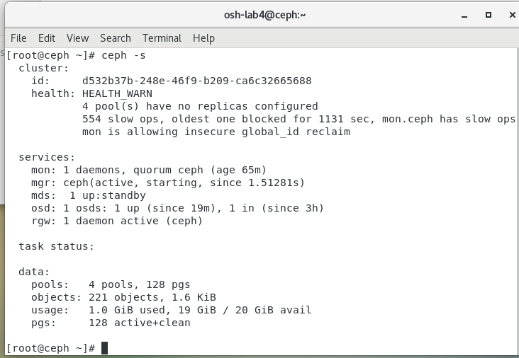

# Ceph 单机部署文档

## 部署环境

- VMware Workstation 16 Pro
- CentOS 7 64位（CentOS 7.9）
- IP 段：192.168.153.0（实验机从 192.168.153.128 开始）

## 部署过程

### 配置主机名

```shell
# 设置 hostname
hostnamectl set-hostname ceph
 
# 配置 hosts 解析
echo "192.168.153.128 ceph">>/etc/hosts
 
# 重启
reboot
```

### 关闭防火墙

```shell
# 关闭防火樯
systemctl disable firewalld 
systemctl stop firewalld 

# 关闭 selinux 
setenforce 0
sed -i 's/^SELINUX=.*/SELINUX=disabled/' /etc/selinux/config 
```

### SSH配置免密

```shell
# 给ceph单节点配置免密
ssh-keygen -t rsa -P '' -f ~/.ssh/id_rsa
cat ~/.ssh/id_rsa.pub >> ~/.ssh/authorized_keys

# 权限设置 644
chmod 644 ~/.ssh/authorized_keys
```

### 安装 ceph-deploy

```shell
# yum方式安装
yum install -y ceph-deploy

# 检验版本
ceph-deploy --version
```

### 创建 ceph 集群

这里我们使用单节点部署，需将集群的副本数量设置为1，创建完后修改 ceph.conf 文件

```shell
# 创建一个目录保存ceph配置及密钥
mkdir -p /data/services/ceph 

# 创建ceph cluster集群
cd /data/services/ceph 
ceph-deploy new ceph

# 因为是单节点部署，需将集群的副本数量设置为1，修改ceph.conf文件
[root@ceph ceph]# echo "osd pool default size = 1" >>  ceph.conf
[root@ceph ceph]# echo "osd pool default min size = 1" >>  ceph.conf
```

### 安装 ceph

```shell
# 安装L版本的软件
yum install -y ceph ceph-radosgw
```

### 初始化 mon

```shell
## 初始化 monitor
ceph-deploy mon create-initial

## 把配置文件和密钥拷贝到管理节点和Ceph节点
ceph-deploy admin ceph

## 确保对秘钥环有权限
chmod +r /etc/ceph/ceph.client.admin.keyring

cp /data/services/ceph/ceph*  /etc/ceph/
chmod +r /etc/ceph/ceph* 

# 启动monitor节点后，检查ceph集群
[root@ceph ceph]# ceph -s
  cluster:
    id:     098f5601-a1f1-4eb4-a150-8db0090bc9d7
    health: HEALTH_WARN
            mon is allowing insecure global_id reclaim

  services:
    mon: 1 daemons, quorum ceph (age 4m)
    mgr: no daemons active
    osd: 0 osds: 0 up, 0 in

  data:
    pools:   0 pools, 0 pgs
    objects: 0 objects, 0 B
    usage:   0 B used, 0 B / 0 B avail
    pgs:
```

### 部署 mgr

```shell
## 部署mgr组件
ceph-deploy mgr create ceph

## 查看mgr状态为active
[root@ceph ceph]# ceph -s
  cluster:
    id:     098f5601-a1f1-4eb4-a150-8db0090bc9d7
    health: HEALTH_WARN
            OSD count 0 < osd_pool_default_size 1
            mon is allowing insecure global_id reclaim

  services:
    mon: 1 daemons, quorum ceph (age 10m)
    mgr: ceph(active, since 103s)
    osd: 0 osds: 0 up, 0 in

  data:
    pools:   0 pools, 0 pgs
    objects: 0 objects, 0 B
    usage:   0 B used, 0 B / 0 B avail
    pgs:
```

### 部署 osd

```shell
## 安装lvm2
yum install -y lvm2

# 创建pv
pvcreate /dev/sdb

# 创建 vg 
vgcreate ceph-pool /dev/sdb

# 创建lv，单个osd节点 
lvcreate -n osd0 -l 100%FREE ceph-pool

# 使用xfs格式化
mkfs.xfs  /dev/ceph-pool/osd0

# 添加osd节点
ceph-deploy osd create --data /dev/ceph-pool/osd0 ceph

# 查看集群状态 
[root@ceph ceph]# ceph -s
  cluster:
    id:     098f5601-a1f1-4eb4-a150-8db0090bc9d7
    health: HEALTH_WARN
            mon is allowing insecure global_id reclaim

  services:
    mon: 1 daemons, quorum ceph (age 71m)
    mgr: ceph(active, since 63m)
    osd: 1 osds: 1 up (since 5s), 1 in (since 5s)

  task status:

  data:
    pools:   0 pools, 0 pgs
    objects: 0 objects, 0 B
    usage:   1.0 GiB used, 199 GiB / 200 GiB avail
    pgs:

# 通过ceph osd tree 查看osd的列表情况
[root@ceph ceph]# ceph osd tree
ID CLASS WEIGHT  TYPE NAME              STATUS REWEIGHT PRI-AFF
-1       0.00870 root default
-3       0.00870     host ceph
 0   hdd 0.00290         osd.0              up  1.00000 1.00000
```

到这里就部署完毕了，实机截图：

