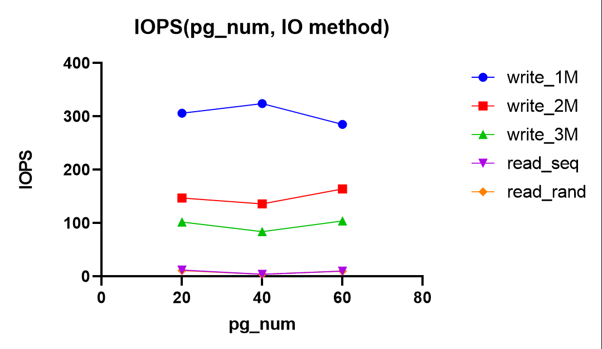

# Ceph 性能测试与优化

## 性能评价指标

- 延迟，指发起 IO 请求到存储系统把 IO 处理完成的时间间隔。

  - 合理性：作为一个存储管理系统，如果 IO 请求的延迟越低，说明该存储系统的响应速度越快，性能越好。

  - 注：常以 ms 或 us 为单位，通常考虑它的平均值和高位百分数。

- IOPS，即每秒钟能处理的读写请求数量。

  - 合理性：IOPS 反映了 IO 处理的速度，IOPS 越大说明存储系统响应 IO 的速度越快，性能越好。

  - 注：每个 IO 请求都有自己的特性，比如读还是写，是顺序读写还是随机读写、IO 的大小是多少等。因为IO有这些特点，所以我们讨论存储系统 IOPS 性能的时候，经常需要更加具体的模式，比如顺序 IOPS、随机写 IOPS 等。

    > IOPS 的数值会随这样的参数不同而有很大的不同，这些参数的变化包括：
    >
    > - 读取和写入的比例（顺序读写以及随机读写的比例）
    >
    > - 读写大小
    >
    > - 线程数量
    >
    > - 读写队列深度
    >
    > 此外，系统配置等因素也会影响IOPS的结果，比如操作系统的设置、存储设备的驱动程序特点、操作系统后台运行的作业等。

- 读吞吐率/带宽

  - 合理性：读吞吐率/带宽反映了存储系统执行读操作的实际数据传输速率，如果读带宽越大，说明该存储系统响应读操作时的速度就越快，读操作性能越好。
  - 注：通常以 MBps 或 GBps 为单位。

- 写吞吐率/带宽

  - 合理性：写吞吐率/带宽反映了存储系统执行写操作的实际数据传输速率，如果写带宽越大，说明该存储系统响应写操作时的速度就越快，写操作性能越好。

  - 注：吞吐率 = IOPS * IO大小；这里 IO 的具体特性很重要，比如是顺序还是随机，IO 大小等。

- 最大支持的存储节点数

  - 合理性：Ceph 扩展性强，理论上支持上千个存储节点，支持的存储节点数越多，在一个方面就反映了该存储系统的健壮性和可扩展性越好。

## 本性能测试选择的评价指标

IOPS（以 Aver IOPS 计）、延迟（以 Aver latency 计）、写带宽（以 Bandwidth 计）、读带宽（以 Bandwidth 计）。

## 测试流程

由于不同 IO 请求性质不同，因此本次测试共测试五种 IO：写入（包大小 1M）、写入（包大小 2M）、写入（包大小 3M）、顺序读、随机读。

对性能进行优化的参数我们选定为创建 pool 时的 pg_num，本次测试选择了 60、40、20 三个 pg_num。

创建 pool 的语句：

```shell
ceph osd pool create test {pg_num}
```

使用 rados 进行性能测试，对五种 IO 的测试语句分别是：

```shell
rados bench -p test 10 write -b 1M --no-cleanup
rados bench -p test 10 write -b 2M --no-cleanup
rados bench -p test 10 write -b 3M --no-cleanup
rados bench -p test 10 seq
rados bench -p test 10 rand
```

由于虚拟机支持快照功能，所以每次写入的操作都回到没有任何写入时的快照。测试读操作的环境是写入（包大小 3M）之后的。

测试原始数据附在最后，下面是处理过的数据及分析。

## 数据处理和分析

按照 IO 种类来对性能进行分析。




以 pg_num = 40 为初始状态，计算各性能指标提升率：

> 注：各性能指标为：IOPS，1/Latency，Bindwidth(W)，Bindwidth(R)

IOPS 分析：

|  提升  | Write_1M |  Write_2M  |  Write_3M  | Read_seq | Read_rand |
| :----: | :------: | :--------: | :--------: | :------: | :-------: |
| 40->20 |  -5.56%  |   8.08%    | **21.42%** | **300%** | **275%**  |
| 40->60 | -12.04%  | **20.58%** | **23.81%** | **250%** | **250%**  |

延迟分析：

|  提升  | Write_1M |  Write_2M  |  Write_3M  | Read_seq | Read_rand |
| :----: | :------: | :--------: | :--------: | :------: | :-------: |
| 40->20 |  -5.74%  |   8.45%    | **21.90%** | **276%** | **263%**  |
| 40->60 | -11.98%  | **20.18%** | **23.89%** | **231%** | **230%**  |

写带宽分析：

|  提升  | Write_1M |  Write_2M  |  Write_3M  |
| :----: | :------: | :--------: | :--------: |
| 40->20 |  -5.56%  |   8.05%    | **21.73%** |
| 40->60 | -12.03%  | **20.07%** | **23.32%** |

读带宽分析：

|  提升  | Read_seq | Read_rand |
| :----: | :------: | :-------: |
| 40->20 | **278%** | **265%**  |
| 40->60 | **233%** | **229%**  |

经过数据处理发现，将 pg_num 从 40 更改为 60 后，各 IO 操作（除了写入（包大小1M）之外）的性能指标都有了 20% 以上的提升。

原因可能是：pg_num = 40 可能无法发挥寻找最优读写位置的优势。

## 附：原始测试输出数据

每个 pg_num 测试组按 W1, W2, W3, Rseq, Rrand 的顺序。

pg_num = 40

```
[root@ceph ~]# rados bench -p test 10 write -b 1M --no-cleanup
hints = 1
Maintaining 16 concurrent writes of 1048576 bytes to objects of size 1048576 for up to 10 seconds or 0 objects
Object prefix: benchmark_data_ceph_9945
  sec Cur ops   started  finished  avg MB/s  cur MB/s last lat(s)  avg lat(s)
    0      16        16         0         0         0           -           0
    1      16       343       327    299.02       327   0.0634276   0.0522528
    2      16       676       660    315.17       333   0.0330728   0.0502414
    3      16      1021      1005   324.791       345   0.0584956   0.0488979
    4      16      1295      1279   312.337       274  0.00884181   0.0507516
    5      16      1621      1605   314.857       326   0.0529328    0.050509
    6      16      1939      1923    315.22       318   0.0906542   0.0504875
    7      16      2274      2258   317.951       335   0.0550003   0.0500489
    8      16      2612      2596   320.408       338   0.0970432    0.049756
    9      16      2953      2937   322.561       341   0.0216878   0.0494214
Total time run:         10.0286
Total writes made:      3259
Write size:             1048576
Object size:            1048576
Bandwidth (MB/sec):     324.972
Stddev Bandwidth:       21.2955
Max bandwidth (MB/sec): 345
Min bandwidth (MB/sec): 274
Average IOPS:           324
Stddev IOPS:            21.2955
Max IOPS:               345
Min IOPS:               274
Average Latency(s):     0.0492305
Stddev Latency(s):      0.0298953
Max latency(s):         0.198386
Min latency(s):         0.002544
```

```
[root@ceph ~]# rados bench -p test 10 write -b 2M --no-cleanup
hints = 1
Maintaining 16 concurrent writes of 2097152 bytes to objects of size 2097152 for up to 10 seconds or 0 objects
Object prefix: benchmark_data_ceph_10333
  sec Cur ops   started  finished  avg MB/s  cur MB/s last lat(s)  avg lat(s)
    0      16        16         0         0         0           -           0
    1      16       130       114   219.304       228    0.103237    0.137709
    2      16       247       231   226.097       234    0.120582    0.137675
    3      16       380       364   238.957       266    0.121076    0.130516
    4      16       532       516    254.97       304   0.0949148    0.123386
    5      16       635       619   245.255       206    0.197787    0.127133
    6      16       767       751   248.222       264   0.0747039    0.126534
    7      16       920       904   256.276       306   0.0779799    0.123991
    8      16      1071      1055   261.731       302   0.0639887     0.12128
    9      16      1234      1218   268.736       326     0.12561    0.118178
Total time run:         10.0606
Total writes made:      1378
Write size:             2097152
Object size:            2097152
Bandwidth (MB/sec):     273.941
Stddev Bandwidth:       41.5572
Max bandwidth (MB/sec): 326
Min bandwidth (MB/sec): 206
Average IOPS:           136
Stddev IOPS:            20.7786
Max IOPS:               163
Min IOPS:               103
Average Latency(s):     0.11679
Stddev Latency(s):      0.0450575
Max latency(s):         0.332562
Min latency(s):         0.0159651
```

```
[root@ceph ~]# rados bench -p test 10 write -b 3M --no-cleanup
hints = 1
Maintaining 16 concurrent writes of 3145728 bytes to objects of size 3145728 for up to 10 seconds or 0 objects
Object prefix: benchmark_data_ceph_10319
  sec Cur ops   started  finished  avg MB/s  cur MB/s last lat(s)  avg lat(s)
    0      16        16         0         0         0           -           0
    1      16        50        34   98.4555       102     0.21895    0.408657
    2      16       102        86   126.277       156    0.232149    0.345972
    3      16       156       140    137.44       162    0.188937    0.328944
    4      16       223       207   152.813       201     0.20778    0.303485
    5      16       316       300   177.513       279    0.127692    0.266116
    6      16       433       417   205.953       351    0.117231    0.230128
    7      16       547       531   225.083       342   0.0644607    0.211768
    8      16       648       632     234.7       303    0.121534    0.203035
    9      16       756       740   244.424       324    0.113722    0.194609
   10      16       855       839   249.587       297      0.1846    0.189104
Total time run:         10.1458
Total writes made:      855
Write size:             3145728
Object size:            3145728
Bandwidth (MB/sec):     252.813
Stddev Bandwidth:       88.7294
Max bandwidth (MB/sec): 351
Min bandwidth (MB/sec): 102
Average IOPS:           84
Stddev IOPS:            29.5765
Max IOPS:               117
Min IOPS:               34
Average Latency(s):     0.189841
Stddev Latency(s):      0.102822
Max latency(s):         0.72392
Min latency(s):         0.0629862
```

测试顺序读：

```
[root@ceph ~]# rados bench -p test 10 seq
hints = 1
  sec Cur ops   started  finished  avg MB/s  cur MB/s last lat(s)  avg lat(s)
    0      16        16         0         0         0           -           0
    1      16        30        14   41.5064        42    0.878707    0.436503
    2      16        32        16   23.4663         6     1.62323    0.551666
    3      16        33        17   16.6439         3     2.83794    0.686153
    4      16        35        19   13.9177         6     3.64081    0.963646
    5      16        37        21   12.3493         6     3.68621     1.23926
    6      16        40        24   11.7264         9     4.42745     1.69024
    7      16        43        27   11.3214         9      6.4807     2.20086
    8      16        46        30   11.0191         9     7.96628     2.70338
    9      16        55        39   12.7608        27     5.94897      3.2391
   10      16        61        45   13.2664        18     1.57248     3.19541
   11      16        62        46   12.3012         3     2.70134     3.18467
   12      16        62        46   11.2759         0           -     3.18467
   13      15        62        47   10.6162       1.5     3.63898     3.19434
Total time run:       13.9628
Total reads made:     62
Read size:            3145728
Object size:          3145728
Bandwidth (MB/sec):   13.3211
Average IOPS:         4
Stddev IOPS:          3.99198
Max IOPS:             14
Min IOPS:             0
Average Latency(s):   3.5497
Max latency(s):       7.96628
Min latency(s):       0.0781592
```

测试随机读：

```
[root@ceph ~]# rados bench -p test 10 rand
hints = 1
  sec Cur ops   started  finished  avg MB/s  cur MB/s last lat(s)  avg lat(s)
    0      16        16         0         0         0           -           0
    1      16        23         7   19.7484        21    0.924265    0.532526
    2      16        26        10   14.4999         9     1.93233    0.827583
    3      16        28        12    11.689         6     2.99156     1.13422
    4      16        29        13   9.54967         3     3.60456     1.32425
    5      16        31        15   8.83863         6     4.67753     1.74916
    6      16        33        17   8.36767         6      5.5131     2.16722
    7      16        39        23   9.71584        18     4.94481     2.87366
    8      16        45        29   10.7288        18     3.69486     3.42754
    9      16        48        32   10.5348         9     2.88284     3.48785
   10      16        54        38   11.2653        18     2.40275     3.59071
   11      16        54        38   10.1798         0           -     3.59071
Total time run:       11.9856
Total reads made:     54
Read size:            3145728
Object size:          3145728
Bandwidth (MB/sec):   13.5162
Average IOPS:         4
Stddev IOPS:          2.38175
Max IOPS:             7
Min IOPS:             0
Average Latency(s):   3.51573
Max latency(s):       7.74661
Min latency(s):       0.248672
```

pg_num = 20

```
[root@ceph ~]# rados bench -p test 10 write -b 1M --no-cleanup
hints = 1
Maintaining 16 concurrent writes of 1048576 bytes to objects of size 1048576 for up to 10 seconds or 0 objects
Object prefix: benchmark_data_ceph_92993
  sec Cur ops   started  finished  avg MB/s  cur MB/s last lat(s)  avg lat(s)
    0      16        16         0         0         0           -           0
    1      16       298       282   273.188       282   0.0390704    0.056495
    2      16       640       624   307.022       342  0.00856368   0.0511873
    3      16       905       889   293.144       265   0.0900386   0.0541698
    4      16      1171      1155     286.4       266   0.0655642   0.0551665
    5      16      1496      1480   293.998       325  0.00586718   0.0538499
    6      16      1815      1799   298.046       319  0.00733173   0.0531413
    7      16      2144      2128   302.357       329   0.0539433   0.0526284
    8      16      2433      2417   300.671       289   0.0270104   0.0529524
    9      16      2761      2745   303.643       328   0.0405158   0.0522583
Total time run:         10.0182
Total writes made:      3068
Write size:             1048576
Object size:            1048576
Bandwidth (MB/sec):     306.244
Stddev Bandwidth:       29.5296
Max bandwidth (MB/sec): 342
Min bandwidth (MB/sec): 265
Average IOPS:           306
Stddev IOPS:            29.5296
Max IOPS:               342
Min IOPS:               265
Average Latency(s):     0.0522429
Stddev Latency(s):      0.0407544
Max latency(s):         0.226932
Min latency(s):         0.00270403
```

```
[root@ceph ~]# rados bench -p test 10 write -b 2M --no-cleanup
hints = 1
Maintaining 16 concurrent writes of 2097152 bytes to objects of size 2097152 for up to 10 seconds or 0 objects
Object prefix: benchmark_data_ceph_9845
  sec Cur ops   started  finished  avg MB/s  cur MB/s last lat(s)  avg lat(s)
    0      16        16         0         0         0           -           0
    1      16        32        16   29.5033        32    0.438704    0.443227
    2      16       167       151   144.587       270   0.0823515    0.208639
    3      16       320       304   196.654       306    0.101443    0.156227
    4      16       466       450   219.733       292   0.0804787    0.141777
    5      16       616       600   235.449       300   0.0840296    0.133011
    6      16       785       769   252.119       338   0.0433745    0.124535
    7      16       964       948   266.981       358   0.0671816    0.117676
    8      16      1152      1136   280.317       376   0.0748471    0.112536
    9      16      1327      1311   287.879       350   0.0940326    0.109638
Total time run:         10.0651
Total writes made:      1486
Write size:             2097152
Object size:            2097152
Bandwidth (MB/sec):     295.278
Stddev Bandwidth:       103.218
Max bandwidth (MB/sec): 376
Min bandwidth (MB/sec): 32
Average IOPS:           147
Stddev IOPS:            51.6091
Max IOPS:               188
Min IOPS:               16
Average Latency(s):     0.10763
Stddev Latency(s):      0.0758976
Max latency(s):         0.717761
Min latency(s):         0.0216792
```

```
[root@ceph ~]# rados bench -p test 10 write -b 3M --no-cleanup
hints = 1
Maintaining 16 concurrent writes of 3145728 bytes to objects of size 3145728 for up to 10 seconds or 0 objects
Object prefix: benchmark_data_ceph_10206
  sec Cur ops   started  finished  avg MB/s  cur MB/s last lat(s)  avg lat(s)
    0      16        16         0         0         0           -           0
    1      16        88        72   207.704       216    0.174675    0.196286
    2      16       165       149   218.741       231    0.169251    0.207433
    3      16       255       239   234.921       270    0.212204    0.198359
    4      16       368       352   260.208       339    0.107824    0.180822
    5      16       485       469   277.992       351    0.116158    0.169748
    6      16       603       587   290.124       354    0.125708    0.163461
    7      16       712       696   295.322       327     0.11958    0.160128
    8      16       813       797   296.196       303    0.137326    0.160701
    9      16       927       911   301.112       342    0.103019     0.15813
   10      16      1038      1022   304.149       333    0.166782    0.155784
Total time run:         10.109
Total writes made:      1038
Write size:             3145728
Object size:            3145728
Bandwidth (MB/sec):     308.044
Stddev Bandwidth:       50.4539
Max bandwidth (MB/sec): 354
Min bandwidth (MB/sec): 216
Average IOPS:           102
Stddev IOPS:            16.818
Max IOPS:               118
Min IOPS:               72
Average Latency(s):     0.15575
Stddev Latency(s):      0.0555191
Max latency(s):         0.51187
Min latency(s):         0.0577589
```

测试顺序读

```
[root@ceph ~]# rados bench -p test 10 seq
hints = 1
  sec Cur ops   started  finished  avg MB/s  cur MB/s last lat(s)  avg lat(s)
    0      16        21         5   117.371        -1    0.125947   0.0813981
    1      15        53        38   100.408        99    0.569593    0.317008
    2      16        67        51   71.1684        39     1.09709    0.435959
    3      16        73        57   54.2015        18     1.53688    0.557489
    4      16        75        59   42.4092         6     2.01331    0.607367
    5      16        86        70   40.5592        33     2.48239    0.979865
    6      16        91        75   36.3984        15     2.22901     1.07427
    7      16        93        77   32.1001         6     1.90382     1.08549
    8      16        95        79   28.8995         6     2.50358     1.12185
    9      16       118       102     33.22        69    0.632368     1.39469
   10      16       131       115   33.7562        39    0.852498     1.32816
Total time run:       10.5999
Total reads made:     131
Read size:            3145728
Object size:          3145728
Bandwidth (MB/sec):   37.0758
Average IOPS:         12
Stddev IOPS:          10.2198
Max IOPS:             33
Min IOPS:             2
Average Latency(s):   1.28375
Max latency(s):       5.59873
Min latency(s):       0.0527028
```

测试随机读

```
[root@ceph ~]# rados bench -p test 10 rand
hints = 1
  sec Cur ops   started  finished  avg MB/s  cur MB/s last lat(s)  avg lat(s)
    0      16        16         0         0         0           -           0
    1      16        30        14   41.3474        42    0.768433    0.357366
    2      16        32        16   23.5641         6      1.6288    0.478611
    3      16        35        19   18.7273         9     2.44904    0.717203
    4      16        45        29   20.8319        30     4.07116      1.6138
    5      16        65        49   28.3532        60    0.614612     1.49973
    6      16        82        66   31.5789        51    0.592937      1.3998
    7      15        84        69   28.4464         9     1.63818     1.38868
    8      16        88        72   26.0835         9     2.59178     1.42362
    9      16       103        87   28.1003        45     2.00696     1.61221
   10      16       127       111   32.3417        72    0.596212     1.37822
Total time run:       10.6268
Total reads made:     127
Read size:            3145728
Object size:          3145728
Bandwidth (MB/sec):   35.8528
Average IOPS:         11
Stddev IOPS:          8.06157
Max IOPS:             24
Min IOPS:             2
Average Latency(s):   1.33385
Max latency(s):       4.15341
Min latency(s):       0.0394564
```

pg_num = 60

```
[root@ceph ~]# rados bench -p test 10 write -b 1M --no-cleanup
hints = 1
Maintaining 16 concurrent writes of 1048576 bytes to objects of size 1048576 for up to 10 seconds or 0 objects
Object prefix: benchmark_data_ceph_10208
  sec Cur ops   started  finished  avg MB/s  cur MB/s last lat(s)  avg lat(s)
    0      16        16         0         0         0           -           0
    1      16       250       234   217.989       234   0.0741691   0.0704609
    2      16       530       514   247.818       280   0.0392565   0.0633887
    3      16       822       806   261.989       292   0.0225755    0.060701
    4      16      1103      1087   266.623       281   0.0695294   0.0593976
    5      16      1407      1391   273.933       304   0.0202081   0.0579701
    6      16      1702      1686   277.379       295   0.0413738   0.0572304
    7      16      1991      1975   278.926       289   0.0741384   0.0570958
    8      16      2283      2267   280.497       292   0.0720725   0.0568716
    9      16      2591      2575   283.471       308   0.0163934   0.0559898
Total time run:         10.0362
Total writes made:      2868
Write size:             1048576
Object size:            1048576
Bandwidth (MB/sec):     285.764
Stddev Bandwidth:       21.607
Max bandwidth (MB/sec): 308
Min bandwidth (MB/sec): 234
Average IOPS:           285
Stddev IOPS:            21.607
Max IOPS:               308
Min IOPS:               234
Average Latency(s):     0.0559719
Stddev Latency(s):      0.0369602
Max latency(s):         0.238267
Min latency(s):         0.00284993
```

```
[root@ceph ~]# rados bench -p test 10 write -b 2M --no-cleanup
hints = 1
Maintaining 16 concurrent writes of 2097152 bytes to objects of size 2097152 for up to 10 seconds or 0 objects
Object prefix: benchmark_data_ceph_10592
  sec Cur ops   started  finished  avg MB/s  cur MB/s last lat(s)  avg lat(s)
    0      16        16         0         0         0           -           0
    1      16       171       155   303.598       310   0.0827351   0.0997167
    2      16       355       339   335.215       368   0.0915863   0.0927865
    3      16       546       530   350.414       382   0.0775522   0.0901189
    4      16       703       687   341.064       314   0.0923951    0.092407
    5      16       852       836   332.286       298    0.151005   0.0952193
    6      16      1016      1000    331.53       328    0.156198   0.0955376
    7      16      1185      1169   332.422       338   0.0873403   0.0955516
    8      16      1340      1324   329.583       310    0.108207   0.0966626
    9      16      1509      1493   330.441       338   0.0866025   0.0963706
   10      16      1662      1646   327.946       306    0.199715   0.0965926
Total time run:         10.0922
Total writes made:      1662
Write size:             2097152
Object size:            2097152
Bandwidth (MB/sec):     329.365
Stddev Bandwidth:       27.7481
Max bandwidth (MB/sec): 382
Min bandwidth (MB/sec): 298
Average IOPS:           164
Stddev IOPS:            13.874
Max IOPS:               191
Min IOPS:               149
Average Latency(s):     0.0971017
Stddev Latency(s):      0.0322322
Max latency(s):         0.270002
Min latency(s):         0.0309466
```

```
[root@ceph ~]# rados bench -p test 10 write -b 3M --no-cleanup
hints = 1
Maintaining 16 concurrent writes of 3145728 bytes to objects of size 3145728 for up to 10 seconds or 0 objects
Object prefix: benchmark_data_ceph_10556
  sec Cur ops   started  finished  avg MB/s  cur MB/s last lat(s)  avg lat(s)
    0      16        16         0         0         0           -           0
    1      16       114        98   286.423       294    0.101786    0.151764
    2      16       211       195   288.415       291    0.141081    0.148025
    3      16       270       254   251.173       177    0.220796    0.180196
    4      16       346       330   245.046       228     0.11113    0.190708
    5      16       452       436   259.285       318    0.115934     0.18205
    6      16       578       562   278.915       378    0.109137    0.169803
    7      16       701       685   291.598       369    0.130303    0.162721
    8      16       809       793   295.588       324    0.124884    0.160738
    9      16       936       920   304.822       381    0.120803    0.156078
   10      16      1054      1038   309.691       354    0.115159    0.153018
Total time run:         10.1149
Total writes made:      1054
Write size:             3145728
Object size:            3145728
Bandwidth (MB/sec):     312.608
Stddev Bandwidth:       66.9597
Max bandwidth (MB/sec): 381
Min bandwidth (MB/sec): 177
Average IOPS:           104
Stddev IOPS:            22.3199
Max IOPS:               127
Min IOPS:               59
Average Latency(s):     0.153284
Stddev Latency(s):      0.0623328
Max latency(s):         0.501562
Min latency(s):         0.0701942
```

测试顺序读：

```
[root@ceph ~]# rados bench -p test 10 seq
hints = 1
  sec Cur ops   started  finished  avg MB/s  cur MB/s last lat(s)  avg lat(s)
    0      16        16         0         0         0           -           0
    1      16        30        14   40.7112        42    0.706356    0.213091
    2      16        32        16   23.4213         6     1.55882    0.350091
    3      16        33        17   16.6957         3     2.97052    0.504234
    4      16        34        18   13.0638         3      3.5429    0.673049
    5      16        39        23   13.4391        15     4.84198     1.52411
    6      16        59        43   20.9809        60    0.766692     2.04397
    7      16        72        56   23.4806        39     1.42434     1.88931
    8      16        84        68   24.9961        36    0.988498     1.79821
    9      16        98        82   26.8258        42     1.00131     1.69972
   10      16       116       100   29.4907        54    0.900366     1.53957
Total time run:       11.1579
Total reads made:     116
Read size:            3145728
Object size:          3145728
Bandwidth (MB/sec):   31.1886
Average IOPS:         10
Stddev IOPS:          7.1492
Max IOPS:             20
Min IOPS:             1
Average Latency(s):   1.53545
Max latency(s):       5.17535
Min latency(s):       0.0441146
```

测试随机读：

```
[root@ceph ~]# rados bench -p test 10 rand
hints = 1
  sec Cur ops   started  finished  avg MB/s  cur MB/s last lat(s)  avg lat(s)
    0      16        16         0         0         0           -           0
    1      16        30        14   40.3883        42    0.795729    0.262842
    2      16        34        18   26.3911        12     1.78284    0.540024
    3      16        43        27    26.561        27     2.84132     1.13147
    4      16        80        64   47.3127       111     0.69038    0.877918
    5      16       100        84   49.8078        60     1.00855    0.924212
    6      16       123       107    52.893        69    0.787473    0.818439
    7      16       131       115   48.7699        24     1.61129    0.848092
    8      16       134       118   43.8193         9     2.32924    0.885629
    9      16       135       119   39.2922         3     2.26285    0.897202
   10      16       137       121   35.9452         6     4.22897    0.945955
   11      16       138       122   32.9693         3     4.63047    0.976156
   12      16       138       122   30.2201         0           -    0.976156
   13      11       138       127   28.9652       7.5     6.63434     1.16702
Total time run:       13.3445
Total reads made:     138
Read size:            3145728
Object size:          3145728
Bandwidth (MB/sec):   31.0239
Average IOPS:         10
Stddev IOPS:          11.1476
Max IOPS:             37
Min IOPS:             0
Average Latency(s):   1.52894
Max latency(s):       7.346
Min latency(s):       0.0630597
```