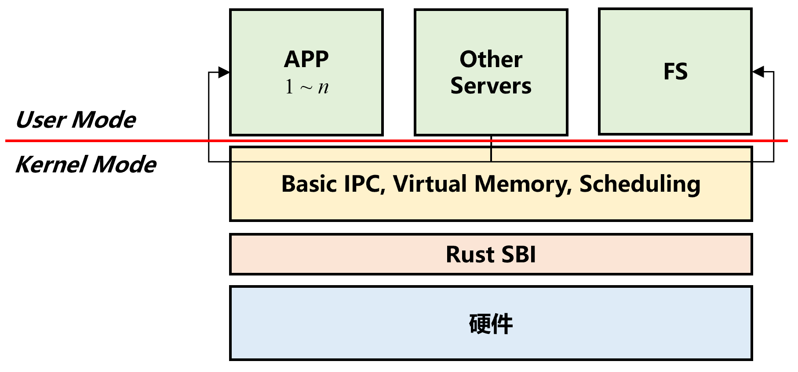

# x-realism 结题报告

## 1 项目简介

内核是操作系统的核心，它是硬件和计算机进程之间的**主要接口**。内核将这两者连接起来，以便尽可能有效地调度资源。本项目旨在基于现有的轮子，吸纳多个平台的优点，实现一个我们自己的操作系统内核。

我们的操作系统内核计划是微内核架构的。微内核是提供操作系统核心功能的内核的精简版本，它能在很小的内存空间内增加移植性，提供模块化设计，以使用户安装不同的接口。

从已有的微内核操作系统经验来看，性能问题（主要涉及进程间通信，上下文切换的高开销）一直备受关注，我们期望就此部分进行优化，提高效率。

我们的建构思路是从对应用由简到繁的支持角度出发，满足应用的阶段性需求。根据特性（需求）逐步添加或增强操作系统功能，最终形成一个相对完善的操作系统内核。我们期望通过此项目来加强对操作系统相关理论概念的理解，同时掌握操作系统设计的能力。

## 2 背景和立项依据

### 2.1 项目背景

#### 2.1.1 目前流行的 OS 的不足

- Windows
  - 系统稳定性差。Windows 的各个程序不是相互独立的，软件的崩溃容易导致系统瘫痪。
  - 软件管理安装机制差，软件和软件之间不隔离配置，而是共用一个庞大的全局注册表，各个软件有自己设计的安装和卸载机制，从而很难说删除“干净”某个软件。
  - 安全性差，即使存在自带的 Windows Defender，电脑仍然容易遭受病毒的攻击，因此常常需要不断地进行系统更新以获取最新的安全补丁。

- Mac OS
  - 硬件升级和定制化困难，因为 Mac 电脑的 CPU 和内存等与其他硬件和操作系统的耦合性很高，更换硬件可能导致系统拒绝启动。

- Linux
  - 驱动问题。Linux 无法做到系统与驱动分离，驱动没有稳定的接口，内核变动时驱动就得跟着变动，导致驱动的开发困难，很多设备缺乏好用的驱动。
  - Linux 内核是宏内核，可移植性较差，同时很多系统服务进程运行在内核态，服务的故障会影响整个系统。

#### 2.1.2 微内核原始架构设计

微内核与宏内核设计的比较可用一张表来概述：

|          | 宏内核 | 微内核 |
| :------: | :----: | :----: |
|  模块化  |        |   √    |
|  复杂性  |   √    |        |
|  灵活性  |        |   √    |
| 可维护性 |        |   √    |
|   安全   |        |   √    |
|   性能   |   √    |        |
|  兼容性  |        |   √    |

微内核是可以提供实现操作系统所需机制的近乎最少数量的软件。这些机制包括低级地址空间管理、线程管理和进程间通信。其基本架构如下面右图所示。


微内核必须提供一些核心功能。至少包括：

- 处理地址空间的机制，内存管理机制
- 一些用于管理 CPU 分配的执行抽象，通常是**进程**
- **进程间通信**，需要调用在它们自己的地址空间中运行的 Server

其他一切都可以在用户模式程序中完成，尽管在某些处理器架构上实现为用户程序的设备驱动程序可能需要特殊权限才能访问 I/O 硬件。

微内核的一个关键组件是良好的 IPC 系统和虚拟内存管理器设计，它允许以安全的方式在用户模式服务器中实现页面错误处理和交换。由于所有服务都由用户模式程序执行，因此程序之间的有效通信方式是必不可少的，远比单片内核更重要。IPC 系统的设计决定了微内核的成败。为了有效，IPC 系统不仅必须具有低开销，而且还必须与 CPU 调度很好地交互。

#### 2.1.3 目前微内核设计的不足

- 早期，微内核操作系统利用硬件隔离机制来实现故障隔离和恢复。Minix 3 是当时著名的微内核操作系统。然而，传统的操作系统设计无法满足日益增长的可靠性和安全性要求。

- Redox 是 Rust 中的微内核操作系统，但它缺乏故障恢复机制。
- Theseus 是一个优秀的单内核操作系统，具有故障恢复功能。然而，作为单内核操作系统，它无法将用户程序从内核模块中分离出来，这使得恶意用户任务危及整个系统。

### 2.2 立项依据

#### 2.2.1 rCore 项目

rCore 项目旨在一步一步展示如何从零开始用 Rust 语言写一个基于 RISC-V 架构的类 Unix 内核 。其目标是以简洁的 RISC-V 基本架构为底层硬件基础，根据上层应用从小到大的需求，按 OS 发展的历史脉络，逐步讲解如何设计实现能满足“从简单到复杂”应用需求的多个“小”操作系统。并且在设计实现操作系统的过程中，逐步解析操作系统各种概念与原理的知识点，做到有“理”可循和有“码”可查，最终让学生通过操作系统设计与实现来深入地掌握操作系统的概念与原理。

以上这些想法让 rCore 项目具有与我们项目匹配的天生优势——简单、清楚。即使 rCore 其实是一种典型的宏内核设计，我们也很容易在其上做出改动，让其符合我们的微内核设计。


rCore 已经完成的工作有：进程概念管理、段页式内存管理、基于文件概念的 IPC、文件系统。本项目将以 rCore 实现到文件系统的代码为基本框架，在此基础上实现内核的 Basic IPC，并逐步删去其内核对文件系统的依赖，最终实现微内核架构。

#### 2.2.2 L4

L4 是一种微内核构架的操作系统内核，最初由约亨·李德克（Jochen Liedtke）设计，前身为 L3 微内核。后序发展上，L4 主要用于类 Unix、可移植操作系统接口( POSIX ) 兼容类型。

L4 秉承极简，高效和安全的设计理念：

- Mach 的 IPC 运行缓慢的一个很重要原因是 IPC 代码段过大，会发生较多 L1 cache miss，很影响时间。这启发了微内核的一个设计逻辑： **微内核本身必须充分小**。为此，L4 以及它的前身 L3 的很多代码采用汇编语言编写。
- L4 使用同步 IPC，这意味着一个集合通信模型，当发送者和接收者都准备好时交换消息。如果两者都在同一个内核上运行，这意味着其中一个将阻塞，直到另一个调用 IPC 操作。
- 在 L4 中，IPC 是通过 Endpoint 来实现的。Endpoint 可以被认为是一个邮箱，发送者和接收者通过该邮箱通过握手交换消息。任何拥有 Send 能力的人都可以通 Endpoint 发送消息，任何拥有 Receive 权限的人都可以接收消息。这意味着每个端点可以有任意数量的发送者和接收者。特别是，无论有多少线程尝试从 Endpoint 接收，特定消息仅传递给一个接收者（队列中的第一个接收者）。

#### 2.2.3 seL4

seL4 是 L4 微内核家族的一员，其着重强化了 L4 内核的安全性。seL4 的形式验证为在系统中运行的应用程序之间提供了最高的 *隔离* 保证，这意味着可以控制系统某个部分的妥协并防止损害系统的其他可能更关键的部分。

具体来说，seL4 的实现在形式上通过不同层次的接口的抽象以及每一层次的状态机形式验证被证明是正确的，并且如果配置正确，它的操作也已被证明在最坏情况下执行时间具有安全上限。

**地址空间**：根任务可以实施其资源管理策略，例如通过将系统划分为安全域并将每个域交给一个不相交的无类型内存子集。用户空间可直接访问的唯一对象是“框架对象”：这些对象可以被映射到页表，之后用户空间可以写入由这些框架对象表示的物理内存。简而言之，seL4 将内核资源的管理导出到用户级别，并使它们受到与用户资源相同的基于能力的访问控制。

**通信**：通信可以通过 IPC 或共享内存进行。IPC 通常应用于短消息，不长于几百字节的消息大小，这是依赖实现定义和体系结构的限制，但通常消息应该保持在几十个字节。对于较长的消息，应使用共享缓冲区。共享缓冲区访问可以通过通知机制同步。IPC有两种支持形式：通过端点传递的同步消息（类似端口的目的地，没有内核内缓冲），以及通过异步端点传递的异步通知（由单个内核内字组成的集合对象，用于使用逻辑or组合IPC发送）。远程过程调用语义通过应答功能在同步IPC上实现。发送功能由初始端点功能生成。

**快速路径 IPC**：在任何一个系统调用上，内核入口机制都直接调用快速路径代码。快速路径的前半部分检查当前情况是否属于优化情况。如果是这样，则快速路径的后半部分处理系统调用。如果不是，则快速路径将回调标准seL4系统调用入口点（有时称为慢路径），该入口点处理更一般的情况。此控制流如图所示。


#### 2.2.4 Rust for OS


最初的 Unix 系统是完全用汇编语言写出来的，之后 B 语言和 NB (New B) 语言都被使用过。由于这些语言中只能处理计算机字节，没有类型并且不支持浮点运算，Dennis Ritchie 发明了 C 语言，C 语言从那以后就成为了开发操作系统最流行的编程语言。如今主流操作系统内核的少数部分也用 C++ 实现。

但是编写操作系统内核并不是只能用汇编跟 C，C++，一门语言能否用于编写操作系统，取决于其二进制代码是否能够在裸机上执行（也即不依赖标准库），因为标准库要依赖操作系统为其提供系统调用。

Rust 语言的优势：

[Rust ](http://www.rust-lang.org/)是一门强调**安全**、**并发**、**高效**的系统编程语言。无 GC，实现内存安全机制、无数据竞争的并发机制、无运行时开销的抽象机制，它声称解决了传统 C 语言和 C++ 语言几十年来饱受诟病的内存安全问题，同时还保持了很高的运行效率、很深的底层控制、很广的应用范围，在系统编程领域具有强劲的竞争力和广阔的应用前景。

**高效性**：Rust 无 GC，无 VM，无解释器，具有极小的运行时开销，能充分高效利用CPU和内存等系统资源。

[以下为几门语言的性能对比](https://github.com/famzah/langs-performance)

| Language                                                     | User   | System | Total  | Slower than (C++) | Language version | Source code                                                  |
| ------------------------------------------------------------ | ------ | ------ | ------ | ----------------- | ---------------- | ------------------------------------------------------------ |
| C++ *([optimized with -O2](http://gcc.gnu.org/onlinedocs/gcc-4.4.4/gcc/Optimize-Options.html#Optimize-Options))* | 0.899  | 0.053  | 0.951  | –                 | g++ 6.1.1        | [link](https://github.com/famzah/langs-performance/blob/master/primes.cpp) |
| Rust                                                         | 0.898  | 0.129  | 1.026  | 7%                | 1.12.0           | [link](https://github.com/famzah/langs-performance/blob/master/primes.rs) |
| Java 8 *([non-std lib](https://blog.famzah.net/2010/07/01/cpp-vs-python-vs-perl-vs-php-performance-benchmark/#comment-4084))* | 1.090  | 0.006  | 1.096  | 15%               | 1.8.0_102        | [link](https://github.com/famzah/langs-performance/blob/master/primes-alt.java) |
| Go                                                           | 2.622  | 0.083  | 2.705  | 184%              | 1.7.1            | [link](https://github.com/famzah/langs-performance/blob/master/primes.go) |
| C++ *(not optimized)*                                        | 2.921  | 0.054  | 2.975  | 212%              | g++ 6.1.1        | [link](https://github.com/famzah/langs-performance/blob/master/primes.cpp) |
| Python 3.5                                                   | 17.950 | 0.126  | 18.077 | 1800%             | 3.5.2            | [link](https://github.com/famzah/langs-performance/blob/master/primes.py) |
| Python 2.7                                                   | 25.219 | 0.114  | 25.333 | 2562%             | 2.7.12           | [link](https://github.com/famzah/langs-performance/blob/master/primes.py) |

**安全性**：Rust 设计上是内存安全的，这也是一大亮点和相较 C/C++的优势。

它不允许**空指针**、**悬空指针**或**数据竞争**。其丰富的**类型系统**和**所有权模型**保证了内存安全和线程安全，使得能够在编译时消除许多类别的错误。也就是说，一段能跑起来的代码大概率是安全的。具体特性如下

- **内存管理**：相比 C++，更强调对象的移动语义，安全快速，强调生命周期，所有权等
- **智能指针**：通过智能指针，如 `Box<T>` 来控制存放在**堆**内存中的类型为 `T` 的值；Rust 的智能指针功能丰富
- **类型安全**：对一些基本类型的行为进行了限制，较少甚至消除**语义不明**确行为。
- **错误处理**：使用 `Option<T>` 解决空指针问题；针对可恢复和不可恢复错误有不同处理。

**生产力**：Rust 有内容详尽的**文档**以及开放、友好、高效的**开源社区**。并且有开放的开发**工具链**。

- 集成的包管理工具 cargo 。
- 编译器能提供有效的错误提示和修正信息，减少了 debug 的时间。
- 自动格式化程序 clippy 规定了代码格式，减少了团队磨合统一标准的时间。
- 支持单元测试，不用引入测试框架。

## 3 架构设计

### 3.1 问题分析

- 将内核任务转换为独立的用户空间服务器需要额外的通信，因为服务器必须与内核（也可能与其他服务器）协作才能执行其工作。因此需要额外的上下文切换，并将引入一些性能开销。下面是一些可选的方案：
  - 测量典型请求-响应序列所需的时间，以了解性能损失。（考虑计算密集型和 I/O 密集型场景）
  - 让 Server 的地址空间重合，避免在 Server 之间进行数据交互的地址空间切换。
  - 在计算密集型场景下，禁用时间片轮转的滴答中断。
- rCore 在实现 IPC 之前就已经有了文件的抽象，但是我们的微内核设计中的 IPC 原语应当不依赖于文件的抽象。下面是一些可选的方案：
  - 底层 Basic IPC 提供 `sys_recv` 和 `sys_send` 系统调用，使用 L4 的 Endpoint 设计模式，以进程 PID 替代文件标识符，实现一个基础的 IPC 模型。这里要做的是从 seL4 从 C 到 Rust 的移植。
  - 提供 Basic IPC 和基于文件抽象的 IPC 两套控制流，根据当前文件系统是否可用来实现灵活的 IPC 模式。
  - 参考混合内核，提供一个缺省文件系统。当上位文件系统不存在时，这个文件系统生效，两个文件系统接口统一。

### 3.2 设计方案

首先给出我们微内核操作系统的整个设计结构：



Rust SBI 介于底层硬件和内核之间，是我们内核的底层执行环境。

基于 3.1 节分析的问题，综合考虑，本项目选择如下解决办法：

- 针对 IPC 开销较大的问题，我们：
  - 首先考虑计算密集型和 I/O 密集型场景，分别测量典型请求-响应序列所需的时间，以了解性能损失。
  - 其次将决定权交给用户，让用户根据自己的操作系统要求（从安全、性能和即时性方面考虑）自选安装模式。在不联网的纯计算场景下，可不考虑一些安全性问题，让各 Server 的地址空间重合。
- 针对如何修改 rCore 的 IPC 问题，我们：
  - 首先在底层 Basic IPC 提供 `sys_recv` 和 `sys_send` 系统调用，使用 L4 的 Endpoint 设计模式，以进程 PID 替代文件标识符，实现一个基础的 IPC 模型。
  - 其次，提供 rCore 本身的 easy-fs 作为缺省文件系统。当上位文件系统不存在时，这个文件系统生效。并且在内核中提供初始化的 easy-fs，一旦检测到现有文件系统损坏，又没有可用文件系统时，从备份恢复 easy-fs。

### 3.3 技术路线

#### 3.3.1 Bare-metal

Bare-metal 指的是可以不依赖操作系统运行的可执行文件。因为要写一个 Rust 微内核，我们第一步就需要写出能够在裸机上直接运行的 bare-metal 可执行文件，这在很多教程里都有提及，本项目主要参考 rCore。在写出一个 bare-metal 可执行文件后，逐步往里面添加所需的功能。

例如，逐渐为内核支持函数库的形态，基于 `RustSBI` 完成输出及关机等。

在完成了基本的页表机制和任务调度模块后，即可实现进程模块

#### 3.3.2 进程调度和 IPC

进程调度和 IPC 是我们第一个主要添加的内容。高性能和多任务并发的支持是本项目内核计划实现的两个特性，因此进程调度和 IPC 显得尤为重要。

Rust 语言本身提供对并发的支持。对于单进程应用而言，Rust 中的关键字 `async` 和 `await` 可以让编译器将异步代码用状态机的形式转写成无栈协程，同时有栈协程也可以由用户态的运行时实现，这可以使得我们专注于进程调度的实现，而将线程管理的任务分摊到用户态，通过提供相应的用户态库来方便编写多线程程序

我们自己的进程调度和 IPC 模块包括常规的进程管理，创建进程、销毁进程、进程等待；进程调度相关的算法实现；进程间通信，上下文切换的高效实现。

部分模块需要参考或改写其他项目已有的设计（seL4、Redox）。

#### 3.3.3 信号量机制和多线程

要实现多线程机制，首先需要实现信号量机制，以管理互斥资源和实现同步。

在线程的眼里，信号量是一种每个线程能看到的共享资源，且可以存在多个不同信号量来合理使用不同的资源。所以我们可以把信号量也看成四一种资源，可放在一起让进程来管理。操作系统需要显式地施加某种控制，来确定当一个线程执行 P 操作和 V 操作时，如何让线程睡眠或唤醒线程。

多线程不一定需要操作系统的支持，完全可以在用户态实现。我们在用户态构建一个多线程的的基本执行环境（即线程管理运行时）。 首先分析一个简单的用户态多线程应用的执行过程，然后设计支持这种简单多线程应用的执行环境，包括线程的总体结构、管理线程执行的线程控制块数据结构、以及对线程管理相关的重要函数：线程创建和线程切换。

#### 3.3.4 文件系统等服务

因为是微内核设计，文件系统之类的服务都被隔离成模块。

我们设计的 IPC 提供 Basic IPC 和基于文件抽象的 IPC 两套控制流，根据当前文件系统是否可用来实现灵活的 IPC 模式。为了增强我们微内核操作系统的健壮性，我们以 rCore 框架提供的 easy-fs 文件系统作为微内核服务的的示例。

## 4 实现细节

### 4.1 Rust for OS 的细节

#### 4.1.1 所有权模型和借用检查

引用 `&T/&mut T` 实质上只是一个地址范围，Rust 编译器会在编译的时候进行比较严格的借用检查，来确保在编译期就解决掉很多内存不安全问题。

#### 4.1.2 RAII 编程范式

举例来说，在实现地址空间抽象时，`MapType` 描述该逻辑段内的所有虚拟页面映射到物理页帧的同一种方式，它是一个枚举类型，在内核当前的实现中支持两种方式：

```rust
// os/src/mm/memory_set.rs

#[derive(Copy, Clone, PartialEq, Debug)]
pub struct MapArea {
    vpn_range: VPNRange,
    data_frames: BTreeMap<VirtPageNum, FrameTracker>,
    map_type: MapType,
    map_perm: MapPermission,
}

pub enum MapType {
    Identical,
    Framed,
}
```

当逻辑段采用 `MapType::Framed` 方式映射到物理内存的时候， `data_frames` 是一个保存了该逻辑段内的每个虚拟页面和它被映射到的物理页帧 `FrameTracker` 的一个键值对容器 `BTreeMap` 中，这些物理页帧被用来存放实际内存数据而不是作为多级页表中的中间节点。这用到了 RAII 的思想，将这些物理页帧的生命周期绑定到它所在的逻辑段 `MapArea` 下，当逻辑段被回收之后这些之前分配的物理页帧也会自动地同时被回收。

## 5 实现效果和测试

我们编写的内核将主要在 Qemu 模拟器上运行来检验其正确性。这样做主要是为了方便快捷，只需在命令行输入一行命令即可让内核跑起来。为了让我们的内核能够正确对接到 Qemu 模拟器上，我们首先要对 Qemu 模拟器有一定的了解。我们使用软件 `qemu-system-riscv64` 来模拟一台 64 位 RISC-V 架构的计算机，它包含一个 CPU 、一条物理内存以及若干 I/O 外设。

MTBD

## 6 总结和展望

TBD

## 参考资料

[1] Rustpi: A Rust-powered Reliable Micro-kernel Operating System, Yuanzhi Liang, Lei Wang, Siran Li, Bo Jiang School of Computer Science and Engineering, Beihang University.

[2] NileOS: A Distributed Asymmetric Core-Based Micro-Kernel for Big Data Processing, AHMAD EL-ROUBY, etc., The American University in Cairo, New Cairo 11835, Egypt.

[3] Verified Software: Theories, Tools, and Experiments, 7th International Conference, VSTTE 2015 San Francisco, CA, USA, July 18–19, 2015 Revised Selected Papers.

[4] Comprehensive Formal Verification of an OS Microkernel, GERWIN KLEIN, etc., Sydney , Australia

[5] Toward a True Microkernel Operating System, Retrieved 22 June 2015.

[6] [Advantages and disadvantages of Windows operating system](https://www.geeksforgeeks.org/advantages-and-disadvantages-of-windows-operating-system/)

[7] [Ownership is Theft: Experiences Building an Embedded OS in Rust](https://patpannuto.com/pubs/levy15ownership.pdf)

[8] [Rust OS comparison](https://github.com/flosse/rust-os-comparison)

[9] [如何用 Rust 编写一个 Linux 内核模块](https://developer.51cto.com/article/670600.html)

[10] [开源项目：使用 Rust 写一个兼容 Linux 的内核](https://jishuin.proginn.com/p/763bfbd6be97)

[11] [CATTmew: Defeating Software-only Physical Kernel Isolation](http://arxiv.org/abs/1802.07060v4)

[12] [rCore-Tutorial-Book 第三版](https://rcore-os.github.io/rCore-Tutorial-Book-v3/)

[13] [Extreme High Performance Computing or Why Microkernels Suck](https://www.kernel.org/doc/ols/2007/ols2007v1-pages-251-262.pdf) 