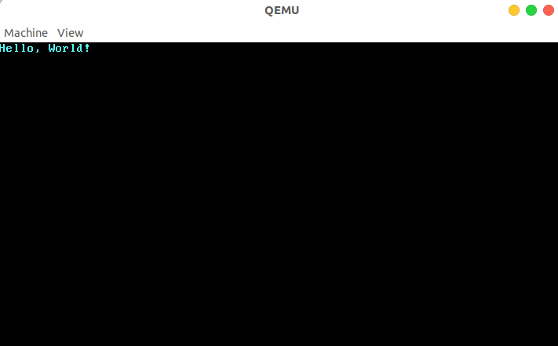
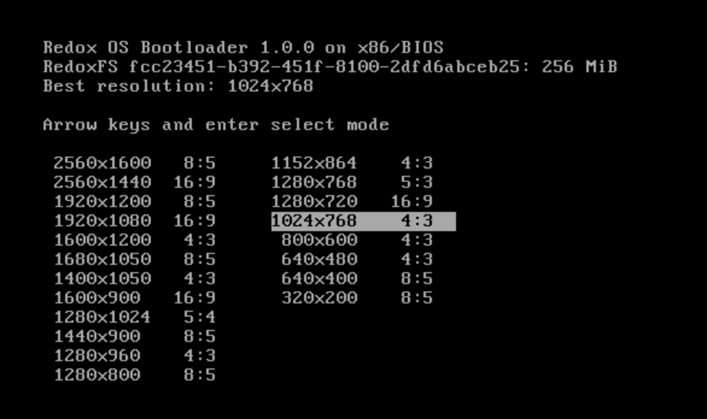

# x-realism 可行性报告

## 目录

[x-realism 可行性报告](#x-realism-%E5%8F%AF%E8%A1%8C%E6%80%A7%E6%8A%A5%E5%91%8A)

- [项目介绍](#%E9%A1%B9%E7%9B%AE%E4%BB%8B%E7%BB%8D)
- [理论依据](#%E7%90%86%E8%AE%BA%E4%BE%9D%E6%8D%AE)
    - [微内核](#%E5%BE%AE%E5%86%85%E6%A0%B8)
        - [进程实现](#%E8%BF%9B%E7%A8%8B%E5%AE%9E%E7%8E%B0)
            - [基本结构](#%E5%9F%BA%E6%9C%AC%E7%BB%93%E6%9E%84)
            - [进程调度](#%E8%BF%9B%E7%A8%8B%E8%B0%83%E5%BA%A6)
        - [IPC 实现](#ipc-%E5%AE%9E%E7%8E%B0)
            - [消息传递](#%E6%B6%88%E6%81%AF%E4%BC%A0%E9%80%92)
            - [快速路径](#%E5%BF%AB%E9%80%9F%E8%B7%AF%E5%BE%84)
    - [Rust](#rust)
        - [特性](#%E7%89%B9%E6%80%A7)
            - [高效](#%E9%AB%98%E6%95%88)
            - [安全](#%E5%AE%89%E5%85%A8)
        - [外部函数接口（FFI）](#%E5%A4%96%E9%83%A8%E5%87%BD%E6%95%B0%E6%8E%A5%E5%8F%A3ffi)
        - [why Rust](#why-rust)
    - [内存管理](#%E5%86%85%E5%AD%98%E7%AE%A1%E7%90%86)
        - [操作系统与真实内存之间的隔离](#%E6%93%8D%E4%BD%9C%E7%B3%BB%E7%BB%9F%E4%B8%8E%E7%9C%9F%E5%AE%9E%E5%86%85%E5%AD%98%E4%B9%8B%E9%97%B4%E7%9A%84%E9%9A%94%E7%A6%BB)
        - [分页式内存管理](#%E5%88%86%E9%A1%B5%E5%BC%8F%E5%86%85%E5%AD%98%E7%AE%A1%E7%90%86)
- [技术依据](#%E6%8A%80%E6%9C%AF%E4%BE%9D%E6%8D%AE)
    - [环境及语言支持](#%E7%8E%AF%E5%A2%83%E5%8F%8A%E8%AF%AD%E8%A8%80%E6%94%AF%E6%8C%81)
        - [no std](#no-std)
    - [裸机程序 demo](#%E8%A3%B8%E6%9C%BA%E7%A8%8B%E5%BA%8F-demo)
    - [微内核](#%E5%BE%AE%E5%86%85%E6%A0%B8-1)
    - [在内核中支持动态内存分配](#%E5%9C%A8%E5%86%85%E6%A0%B8%E4%B8%AD%E6%94%AF%E6%8C%81%E5%8A%A8%E6%80%81%E5%86%85%E5%AD%98%E5%88%86%E9%85%8D)
    - [可用物理页的分配与回收](#%E5%8F%AF%E7%94%A8%E7%89%A9%E7%90%86%E9%A1%B5%E7%9A%84%E5%88%86%E9%85%8D%E4%B8%8E%E5%9B%9E%E6%94%B6)
    - [案例](#%E6%A1%88%E4%BE%8B)
        - [BlogOS](#blogos)
        - [Redox](#redox)
- [技术路线](#%E6%8A%80%E6%9C%AF%E8%B7%AF%E7%BA%BF)
    - [Step1 Bare-metal](#step1-bare-metal)
    - [Step2 进程调度 和 IPC](#step2-%E8%BF%9B%E7%A8%8B%E8%B0%83%E5%BA%A6-%E5%92%8C-ipc)
    - [Step3 内存管理](#step3-%E5%86%85%E5%AD%98%E7%AE%A1%E7%90%86)
    - [Step4 并发](#step4-%E5%B9%B6%E5%8F%91)
    - [Step5 其他模块](#step5-%E5%85%B6%E4%BB%96%E6%A8%A1%E5%9D%97)

## 项目介绍

内核是操作系统的核心。它是硬件和计算机进程之间的**主要接口**。内核将这两者连接起来，以便尽可能有效地调度资源。本项目旨在基于现有的轮子，吸纳多个平台的优点，实现一个我们自己的操作系统内核。

我们的操作系统内核计划实现以下特性：

- 类 Unix 微内核
- x86 架构
- 多任务并发的支持
- **高性能**
- **安全**（漏洞少）
- 实用性

在上述特性中，高性能是我们的一大关注点，因为从当前的微内核架构来看，性能问题（主要涉及进程间通信，上下文切换的高开销）一直备受关注，我们期望就此部分进行优化，提高效率。此外，针对 MMU 的安全问题，我们期望进行合理的设计，设计上追求简单但相对灵活，尽量减少漏洞，保证良好的隔离。

我们建构思路是从对应用由简到繁的支持角度出发，满足应用的阶段性需求。根据特性（需求）逐步添加或增强操作系统功能，最终形成一个相对完善的操作系统内核。我们期望通过此项目来加强对操作系统相关理论概念的理解，同时掌握操作系统设计的能力。

## 理论依据

### 微内核

#### 进程实现

##### 基本结构

对于微内核而言，作为基本调度单位的进程的结构尤为重要。以下列出几个经典的进程结构：

标准的进程控制块 (PCB) 结构一般如下。

- 栈
- 堆
- 可执行代码
- 调度器状态（进程是否需要被得到调度）
- 运行状态（寄存器等信息，方便上下文切换后进行恢复）

下面分析 Redox 的进程基本结构，简化到单个进程（暂时不考虑调度器状态和权限相关）后大致由以下部分组成：

- id: 进程 id
- kfx: 指向内核中的为该进程分配的一块内存，用于在进程切换时存储寄存器信息
- image: 可执行镜像
- heap: 用户堆空间
- stack: 用户栈空间
- sigstack: 用户信号栈
- name: 进程名

可以看到与进程控制块基本结构比较对应

##### 进程调度

首先需要明确进程调度需要完成的一些功能：

- 保存调用者寄存器，尤其是程序计数器（调用者指调用系统调用或 IPC 的进程）
- 更改 MMU 的页表（即 TLB）
- 将 CPU 置于另一种模式（内核模式、用户模式）
- 恢复被调用者寄存器（被调用者指由系统调用或 IPC 调用的进程）

接下来可以考虑进程调度具体使用的算法：

- 先到先服务策略 (FCFS)：最简单的 CPU 调度策略，可以直接用一个队列简单实现，不过问题也层出不穷，如考虑 I/O 时 CPU 与设备利用率相对较低。
- 最短作业优先调度策略 (SJF)：理论上的优秀算法，但在实际实现中，由于无法知道下一个 CPU 区间的长度，故不能在短期 CPU 调度层次上加以实现。
- 优先级调度策略 (PS)：每个进程都有一个关联的优先级，高优先级优先。虽然比较灵活但仍存在饥饿的主要问题。
- 轮转法调度策略 (RR)：专为分时系统设计，类似 FCFS，但增加了抢占以切换进程，是公平的调度策略。
- 多级反馈队列调度策略 (MFQS)：较为成熟的调度策略，可以对其中不同的队列按照情况使用不同的调度算法，并可以控制进程在队列中的进出。

参考 Redox ，使用了时间片轮转调度算法，内核注册一个称为中断处理程序的函数，CPU 会定期调用该函数。这个函数跟踪它被调用的次数，并且每 10 个 ticks 后就会安排下一个准备好调度的进程。

轮转法比较公平，可以作为我们首选。同时，我们也可能考虑 MFQS，因为进程调度在微内核架构上是比较耗费时间的操作，我们希望尽量减少进程调度的次数。

根据不同的算法选择，我们可能需要在进程上附加调度状态信息：

- 运行态：任务正在运行
- 就绪态：任务正在排队等待，一旦有资源可以进入运行态
- 阻塞态：任务正在等待某个外部事件（有延时限制）
- 挂起态：任务不能进入运行态，除非被 Resume 退出挂起态

#### IPC 实现

IPC 实现部分基于 seL4 的实现思路。

##### 消息传递

IPC 具体来说通过端点（Endpoint）进行。端点可以被认为是一个邮箱，发送者和接收者通过该邮箱通过握手交换消息。任何拥有 Send 能力的人都可以通过 Endpoint 发送消息，任何拥有 Receive 上限的人都可以接收消息。这意味着每个端点可以有任意数量的发送者和接收者。特别是，无论有多少线程尝试从 Endpoint 接收，特定消息仅传递给一个接收者（队列中的第一个接收者）。

在调用时 send-only 操作不返回成功指示，只发送 IPC 系统调用 `Send`，从而实现单向数据传输。send-ony 不能用于接收任何信息。结果状态，指示消息是否已被传递，将构成反向通道：接收者可以使用结果状态向发送者发送信息。这将导致允许未经能力明确授权的信息流，不符合设计。(可以将这一点看作是特性)

除“端点对象”外，还要有“通知对象”，这一点的设计与绝大多数的操作系统设计类似，在逻辑上是一个二进制信号量的小数组。它具有相同的操作：“信号”(`Signal`)和“等待”(`Wait`)。所谓二进制也就是互斥的，通过通知对象来进行互斥资源的管理。

一个简单的设计如下：发出通知需要知道通知对象 (Notification objects) 的发送上限，这个上限相当于一个标记，是创建者（通常是通知对象的所有者）设置的位模式。Signal 操作对 Notification 的位数组上的标记进行按位**或**运算。等待操作**阻塞**直到数组**非零**，然后返回位串并将数组**清零**。

##### 快速路径

此前于调研报告中提到 seL4 的快速路径思想可以借鉴，用来实现高效的 IPC。

快速路径(fastpath)是在微内核上的附加前端，用于快速处理一些简单而常用的操作，这样能加速 IPC 的一些步骤执行，从而达到高 IPC 性能。启用或禁用快速路径不会对内核行为产生任何影响，但对性能可以起到优化。

具体实现上，快速路径是内核中经过高度优化的路径，特点就是快。在 seL4 中为了使用快速路径，IPC 必须满足以下条件：

- `seL4_Call` 或 `seL4_ReplyRecv`必须使用。
- 消息中的数据必须适合 `seL4_FastMessageRegisters` 寄存器。
- 进程必须具有有效的地址空间。
- 不得转移任何上限。
- 调度程序中的其他线程不能运行，其优先级高于 IPC 未阻塞的线程。

> `seL4_Call` is a system call, in the receive phase, thread which uses this function is blocked on a one-time capability termed a *reply capability*, and not the endpoint itself.
>
> The reply capability is stored internally in the thread control block (TCB) of the receiver. The system call `seL4_Reply` invokes this capability, which sends an IPC to the client and wakes it up. `seL4_ReplyRecv` does the same, except it sends the reply and blocks on the provided endpoint in a combined system call.

在快速路径中，消息通过寄存器传递(也即上文的 `seL4_FastMessageRegisters`)，无需其它复杂的操作，因而起到高效的目的。

seL4 项目是用 C 语言实现的，我们后续需要完成的是针对其中的快速路径及相关模块用 Rust 进行改写，如上述 seL4 相关的系统调用需适配我们自己的 API，这方面也可以参考 libsel4 的 System Calls 部分，最终的目的还是实现高效的 IPC。

### Rust

Rust 的一些有点以及和其它语言的对比可参见[调研报告](../research.pdf)。以下再简要概括与总结用 Rust 完成本项目的原因。

#### 特性

##### 高效

得益于各种零抽象开销、深入到底层的优化潜力、优质的标准库和三方库实现，Rust 具备非常优秀的性能，其运行效率和 C/C++ 是一个级别。

此外，Rust 的高效还体现在开发上，只要你的代码能通过 Rust 编译器，无需深入优化，在一定程度上就已经具备了优秀的性能。

##### 安全

在安全方面，Rust 有着一套相当完备的特性来保证，包括内存管理(RAII 模式)、所有权模型、智能指针、生命周期、借用规则、移动语义、类型安全、并发编程模型、错误处理等等，再加上 Rust 强大的编译器，同样的，能通过编译的代码在安全性上已经得到的较好的保证。

#### 外部函数接口（FFI）

因本项目主要用 Rust 完成，下面侧重 Rust 调用外部函数 (以 C 为例)。

要把 C 函数给 Rust 使用，需要用 `extern "C"` 标识出一个块，在块内给出 C 函数的声明；原始 C API 需要需要封装才能提供内存安全性和利用像向量这样的高级内容，直接调用 C 函数显然是不安全的，因为 Rust 编译器不会对其进行检查。因此 Rust 规定，调用 C 函数时必须在 unsafe 块中进行，但为了安全性的目标，需要尽力避免这样的操作。

一个比较好的方式是一个库可以选择只暴露出安全的，高级的接口并隐藏不安全的底层细节，我们需要保证声明的正确性，同时对原生的 C API 进行封装，以保证内存安全。例如，在使用 Vector 与 C 模块对接时，需要把 Vector 转换为内存中的指针，这时我们可以用一个模块封装处理对接的函数，只暴露安全、高级的接口，隐藏非安全的内部细节。

#### why Rust

小结一下，本项目的目标是写一个内核，属于系统编程范畴，具有有如下相关需求

- 对硬件的控制
- 对系统底层的控制
- 对 CPU 和内存的高效利用
- 对运算性能的要求
- 对系统安全和内存安全的要求

综合前面的调研结论，总结如下

- 目前常见的操作系统内核都是基于 C 语言的，而 Rust 则是近几年迅速发展，其它语言写操作系统并无竞争力。

- C 语言是为写 UNIX 而诞生的。但是它并不能帮助高效地开发复杂与并发的操作系统（从面向未来角度考虑），从当时实际情况来看，仅仅是希望用一种简洁的方式来代替难以使用的汇编语言抽象出计算机的行为。
- C 语言本身几乎不保证安全性（例如指针，虽然灵活但同样是大量 bug 的罪魁祸首），且 C 语言缺少有效的并发支持。这导致内存和并发漏洞成为当前基于 C 语言的主流操作系统的噩梦。
- Rust 语言具有与 C 一样的硬件控制能力，且大大强化了安全编程和抽象编程能力。从某种角度上看，新出现的 Rust 语言的核心目标是解决 C 的短板，取代 C（可以将 Rust 看做 C/CPP + 内存安全）。所以可以预见，用 Rust 写 OS 将具有很好的开发和运行体验。
- 用 Rust 写 OS 的代价是值得的，虽然其学习曲线可能相对陡峭，但是开发和调试的代价将远小于 C 。
- 考虑本项目需要实现的相关特性和要求，Rust 完美适配高性能和安全的要求。

综上所述，最终选择 Rust 作为开发语言。

### 内存管理

#### 操作系统与真实内存之间的隔离

CPU 访问数据和指令的内存地址是虚地址，通过硬件机制（比如 MMU + 页表查询）进行地址转换，找到对应的物理地址。在内核中建立虚实地址空间的映射机制，给应用程序提供一个基于地址空间的安全虚拟内存环境，就能让应用程序简单灵活地使用内存。

每个应用独占一个地址空间，里面只含有自己的各个段，它可以随意规划属于它自己的各个段的分布而无需考虑和其他应用冲突；同时鉴于应用只能通过虚拟地址读写它自己的地址空间，它完全无法窃取或者破坏其他应用的数据（不在其地址空间内）。这是地址空间抽象和具体硬件机制对应用程序执行的**安全性**和**稳定性**的一种保障。

#### 分页式内存管理

内核以页为单位进行物理内存管理，每个应用的地址空间可以被分成若干个（虚拟） **页面** (Page) ，而可用的物理内存也同样可以被分成若干个（物理） **页帧** (Frame) ，虚拟页面和物理页帧的大小相同。每个虚拟页面在地址转换的过程中都使用与运行的应用绑定的不同的线性映射。

MMU 进行地址转换的时候，虚拟地址会分为两部分（虚拟页号，页内偏移），MMU 首先找到虚拟地址所在虚拟页面的页号，然后查当前应用的页表，根据虚拟页号找到物理页号；最后按照虚拟地址的页内偏移，给物理页号对应的物理页帧的起始地址加上一个偏移量，这就得到了实际访问的物理地址。

在页表针对虚拟页号设置一组保护位，限制**应用对转换得到的物理地址对应的内存的使用方式**，一旦违反了这种限制则会触发异常，并被内核捕获到。通过适当的设置，可以检查一些应用在运行时的明显错误：比如应用修改只读的代码段，或者从数据段取指令来执行。

## 技术依据

### 环境及语言支持

主要环境为如下两项

- Rust/C 开发环境配置
- Qemu 模拟器

C 开发环境是因为本项目设计改写一些 C 模块。

#### no std

本项目要编写一个操作系统内核，我们需要编写不依赖任何操作系统特性的代码。这意味着我们不能使用线程、文件、堆内存、网络、随机数、标准输出，或其它任何需要操作系统抽象和特定硬件的特性；因为我们正在编写自己的操作系统和硬件驱动。

实现这一点，意味着我们不能使用 Rust 标准库(std)的大部分；好在 Rust 有一个对 Rust 语言标准库–std 裁剪过后的 Rust 语言核心库 core。core库是不需要任何操作系统支持的，虽然它的功能也比较受限，但是也包含了 Rust 语言相当一部分的核心机制/特性，是我们依然可以使用的，例如，迭代器、闭包、模式匹配、Option、Result、字符串格式化以及所有权系统。这些剩下的功能也还让我们能够编写表达性强、高层抽象的操作系统，而无需关心未定义行为和内存安全，可以满足我们的大部分功能需求。同时作为一门面向系统（包括操作系统）开发的语言，有很多第三方库也不依赖标准库 std 而仅仅依赖核心库 core。我们同样可以使用这些库，对它们的使用可以很大程度上减轻我们的编程负担。

### 裸机程序 demo

为了表明用 Rust 编写操作系统的可行性，我们首先确保能够用 Rust 构建一个内核最小执行环境，并编写一个独立于操作系统的可执行程序。

Rust 相关环境配置

```bash
rustup install nightly
rustup default nightly
cargo install cargo-binutils
rustup component add llvm-tools-preview
rustup component add rust-src
cargo install cargo-xbuild
cargo install bootimage
```

以上包括安装 Nightly Rust（提供实验性的功能）、`cargo xbuild`工具（以进行交叉编译）、`bootimage` 工具（创建可引导的磁盘映象）、`rustup` 模块 `llvm-tools-preview`（以编译引导程序）。

目标三元组配置清单（`x86_64-os.json`）

```json
{
    "llvm-target": "x86_64-unknown-none",
    "data-layout": "e-m:e-i64:64-f80:128-n8:16:32:64-S128",
    "arch": "x86_64",
    "target-endian": "little",
    "target-pointer-width": "64",
    "target-c-int-width": "32",
    "os": "none",
    "executables": true,
    "linker-flavor": "ld.lld",
    "linker": "rust-lld",
    "panic-strategy": "abort",
    "disable-redzone": true,
    "features": "-mmx,-sse,+soft-float"
}
```

以上为描述目标系统的配置清单，三元组为基于`x86_64`架构，无明确平台供应者，暂无操作系统（`None`）

`Cargo.toml` 配置

```rust
[package.metadata.bootimage]
build-command = ["xbuild"]

[dependencies]
bootloader = "0.9.3"
```

使用已有的`bootloader`包来实现 BIOS 引导程序（基于 Rust 和内联汇编），这也省去了我们自己写汇编的步骤，否则，若是我们基于 risc-v 架构，目前还没这样的工具，就需要自行写汇编，徒增负担。由此可见，基于`x86`架构的一大好处是已经有了成熟的工具链帮助开发，使得风险可控。

 `.cargo/config` 配置

```rust
[build]
target = "x86_64-os.json"

[target.'cfg(target_os = "none")']
runner = "bootimage runner"
```

编译目标以及`qemu`运行相关配置，后续使用`cargo xrun`即可编译并在`qemu`中启动运行。

`main.rs` 内容

```rust
#![no_std]
#![no_main]

use core::panic::PanicInfo;

#[panic_handler]
fn panic(_info: &PanicInfo) -> ! {
    loop {}
}

static HELLO: &[u8] = b"Hello, World!";

#[no_mangle]
pub extern "C" fn _start() -> ! {
    let vga_buffer = 0xb8000 as *mut u8;

    for (i, &byte) in HELLO.iter().enumerate() {
        unsafe {
            *vga_buffer.offset(i as isize * 2) = byte;
            *vga_buffer.offset(i as isize * 2 + 1) = 0xb;
        }
    }

    loop {}
}
```

以上仅仅为实验样例而使用了 unsafe 块，后续出于安全性考虑将尽力避免或者进行封装。

这样就完成了一个最小化内核，能够通过写入 VGA 字符缓冲区的方式，向屏幕输出字符串。



### 微内核

这里分析 redox 进程调度的实现，以证明进程调度作为最小模块在 Rust 中是可以合理实现的：

```rust
pub struct ContextList {
    map: BTreeMap<ContextId, Arc<RwLock<Context>>>,
    next_id: usize
}
```

通过一个 BTreeMap 将进程的 id 映射到了对应的进程上下文

所有进程的 id 是唯一的，每次申请时遍历数组，如果有空位则申请

```rust
pub fn new_context(&mut self) -> Result<&Arc<RwLock<Context>>> {
    if self.next_id >= super::CONTEXT_MAX_CONTEXTS {
        self.next_id = 1;
    }

    while self.map.contains_key(&ContextId::from(self.next_id)) {
        self.next_id += 1;
    }

    if self.next_id >= super::CONTEXT_MAX_CONTEXTS {
        return Err(Error::new(EAGAIN));
    }

    let id = ContextId::from(self.next_id);
    self.next_id += 1;

    assert!(self.map.insert(id, Arc::new(RwLock::new(Context::new(id)))).is_none());

    Ok(self.map.get(&id).expect("Failed to insert new context. ID is out of bounds."))
}
```

这里是产生新进程的实现

```rust
pub fn spawn(&mut self, func: extern fn()) -> Result<&Arc<RwLock<Context>>> {
    let context_lock = self.new_context()?;
    {
        let mut context = context_lock.write();
        let mut fx = unsafe { Box::from_raw(::ALLOCATOR.alloc(Layout::from_size_align_unchecked(512, 16)) as *mut [u8; 512]) };
        for b in fx.iter_mut() {
            *b = 0;
        }
        let mut stack = vec![0; 65_536].into_boxed_slice();
        let offset = stack.len() - mem::size_of::<usize>();
        unsafe {
            let offset = stack.len() - mem::size_of::<usize>();
            let func_ptr = stack.as_mut_ptr().offset(offset as isize);
            *(func_ptr as *mut usize) = func as usize;
        }
        context.arch.set_page_table(unsafe { paging::ActivePageTable::new().address() });
        context.arch.set_fx(fx.as_ptr() as usize);
        context.arch.set_stack(stack.as_ptr() as usize + offset);
        context.kfx = Some(fx);
        context.kstack = Some(stack);
    }
    Ok(context_lock)
}
```

进程调度环节：

```rust
loop {
    unsafe {
        interrupt::disable();
        if context::switch() {      // 检测是否到达时间分片策略设定的时间
            interrupt::enable_and_nop();
        } else {
            // Enable interrupts, then halt CPU (to save power) until the next interrupt is actually fired.
            interrupt::enable_and_halt();
        }
    }
}
```

switch 函数通过

```rust
let ticks = PIT_TICKS.swap(0, Ordering::SeqCst);
```

检测是否需要进行进程调度，是则上下文切换。

### 在内核中支持动态内存分配

相对于 C 语言而言，Rust 语言在 `alloc` crate 中设定了一套简洁规范的接口，只要实现了这套接口，内核就可以很方便地支持动态内存分配了。

`alloc` 库需要我们提供给它一个全局的动态内存分配器，它会利用该分配器来管理堆空间，从而使得与堆相关的智能指针或容器数据结构可以正常工作。具体而言，动态内存分配器需要实现它提供的 `GlobalAlloc` Trait，这个 Trait 有两个必须实现的抽象接口：

```rust
// alloc::alloc::GlobalAlloc

pub unsafe fn alloc(&self, layout: Layout) -> *mut u8;
pub unsafe fn dealloc(&self, ptr: *mut u8, layout: Layout);
```

可以看到，它们类似 C 语言中的 `malloc/free` ，分别代表堆空间的分配和回收，也同样使用一个裸指针（也就是地址）作为分配的返回值和回收的参数。两个接口中都有一个 `alloc::alloc::Layout` 类型的参数， 它指出了分配的需求，分为两部分，分别是所需空间的大小 `size` ，以及返回地址的对齐要求 `align` 。这个对齐要求必须是一个 2 的幂次，单位为字节数，限制返回的地址必须是 `align` 的倍数。

### 可用物理页的分配与回收

首先，需要知道物理内存的哪一部分是可用的。在 `os/src/linker.ld` 中，符号 `ekernel` 指明了内核数据的终止物理地址，在它之后的物理内存都是可用的。

我们用一个左闭右开的物理页号区间来表示可用的物理内存，则：

- 区间的左端点应该是 `ekernel` 的物理地址以上取整方式转化成的物理页号；
- 区间的右端点应该是 `MEMORY_END` 以下取整方式转化成的物理页号。

这个区间将被传给我们后面实现的物理页帧管理器用于初始化。

我们声明一个 `FrameAllocator` Trait 来描述一个物理页帧管理器需要提供哪些功能：

```rust
// os/src/mm/frame_allocator.rs

trait FrameAllocator {
    fn new() -> Self;
    fn alloc(&mut self) -> Option<PhysPageNum>;
    fn dealloc(&mut self, ppn: PhysPageNum);
}
```

即创建一个物理页帧管理器的实例，以及以物理页号为单位进行物理页帧的分配和回收。

我们实现一种最简单的栈式物理页帧管理策略 `StackFrameAllocator` ：

```rust
// os/src/mm/frame_allocator.rs

pub struct StackFrameAllocator {
    current: usize,  //空闲内存的起始物理页号
    end: usize,      //空闲内存的结束物理页号
    recycled: Vec<usize>,
}
```

其中各字段的含义是：物理页号区间 [ `current` , `end` ) 此前均从未被分配出去过，而向量 `recycled` 以后入先出的方式保存了被回收的物理页号（注：我们已经自然的将内核堆用起来了）。

初始化非常简单。在通过 `FrameAllocator` 的 `new` 方法创建实例的时候，只需将区间两端均设为 0 ，然后创建一个新的向量；而在它真正被使用起来之前，需要调用 `init` 方法将自身的 [current,end) 初始化为可用物理页号区间：

```rust
// os/src/mm/frame_allocator.rs

impl FrameAllocator for StackFrameAllocator {
    fn new() -> Self {
        Self {
            current: 0,
            end: 0,
            recycled: Vec::new(),
        }
    }
}

impl StackFrameAllocator {
    pub fn init(&mut self, l: PhysPageNum, r: PhysPageNum) {
        self.current = l.0;
        self.end = r.0;
    }
}
```

核心的物理页帧分配和回收如何实现：

```rust
// os/src/mm/frame_allocator.rs

impl FrameAllocator for StackFrameAllocator {
    fn alloc(&mut self) -> Option<PhysPageNum> {
        if let Some(ppn) = self.recycled.pop() {
            Some(ppn.into())
        } else {
            if self.current == self.end {
                None
            } else {
                self.current += 1;
                Some((self.current - 1).into())
            }
        }
    }
    fn dealloc(&mut self, ppn: PhysPageNum) {
        let ppn = ppn.0;
        // validity check
        if ppn >= self.current || self.recycled
            .iter()
            .find(|&v| {*v == ppn})
            .is_some() {
            panic!("Frame ppn={:#x} has not been allocated!", ppn);
        }
        // recycle
        self.recycled.push(ppn);
    }
}
```

- 在分配 `alloc` 的时候，首先会检查栈 `recycled` 内有没有之前回收的物理页号，如果有的话直接弹出栈顶并返回；否则的话我们只能从之前从未分配过的物理页号区间 [ `current` , `end` ) 上进行分配，我们分配它的左端点 `current` ，同时将管理器内部维护的 `current` 加 `1` 代表 `current` 已被分配了。在即将返回的时候，我们使用 `into` 方法将 usize 转换成了物理页号 `PhysPageNum` 。

    注意极端情况下可能出现内存耗尽分配失败的情况：即 `recycled` 为空且 `current` == `end` 。为了涵盖这种情况， `alloc` 的返回值被 `Option` 包裹，我们返回 `None` 即可。

- 在回收 `dealloc` 的时候，我们需要检查回收页面的合法性，然后将其压入 `recycled` 栈中。回收页面合法有两个条件：

    - 该页面之前一定被分配出去过，因此它的物理页号一定 < `current` ；
    - 该页面没有正处在回收状态，即它的物理页号不能在栈 `recycled` 中找到。

    我们通过 `recycled.iter()` 获取栈上内容的迭代器，然后通过迭代器的 `find` 方法试图寻找一个与输入物理页号相同的元素。其返回值是一个 `Option` ，如果找到了就会是一个 `Option::Some` ，这种情况说明我们内核其他部分实现有误，直接报错退出。

### 案例

由于后续推进项目时还涉及改写其他项目或利用一些其它相关项目，以下针对相关项目进行了运行及测试。

#### BlogOS

1. 到 GitHub 上 clone 该 Repo，clone 下来的默认只有 main 分支，我们可以通过

   ```shell
   $ git worktree add <subdirname> post-xx
   ```

   来创建一个名为 `subdirname` 的子目录，包含 post-xx 分支的内容。

2. 来到对应博客，照着敲命令就行。例如对于 post-01，命令为：

   ```shell
   $ rustup target add thumbv7em-none-eabihf
   $ cargo build --target thumbv7em-none-eabihf
   ```

   post-02：

   ```shell
   $ cargo install bootimage
   $ rustup component add llvm-tools-preview
   $ cargo bootimage
   $ cargo run
   ```

#### Redox

Redox 只要按照仓库中 README 的 Quick Setup 部分来：

```shell
# Run bootstrap setup
$ curl -sf https://gitlab.redox-os.org/redox-os/redox/raw/master/bootstrap.sh -o bootstrap.sh && bash -e bootstrap.sh

# Change to project directory
$ cd redox

# Build Redox
$ make all

# Launch using QEMU
$ make qemu
```

其中 `curl` 和 `make all` 这两步可能会消耗大量的时间。由于 Redox 不仅是一个内核，还是成熟的操作系统，最终占了 11.7 GB 的磁盘空间，因此在开始之前应该检查一下磁盘空间是否充足。

执行 `make qemu` 后，会来到选择分辨率的界面：



随便选一个合适的，就可以进入 Redox：


使用搜索引擎，发现默认 Username 为 `user`，Password 为空，进入桌面：


## 技术路线

### Step1 Bare-metal

Bare-metal（裸金属），有时也称（freestanding），指的是可以不依赖操作系统运行的可执行文件。因为要写一个 Rust 微内核，我们第一步就需要写出能够在 x86 机器上直接运行的 bare-metal 可执行文件，这在很多教程里都有提及，本项目主要参考 BlogOS 和 rCore。在写出一个 bare-metal 可执行文件后，逐步往里面添加所需的功能。上面已经给出了一个裸机程序 demo 。

进阶目标是封装成函数库的形态，为内核支持函数库的形态，基于 `RustSBI`完成输出及关机。

这一步重点是为后续搭建环境，让内核首先能跑起来。

### Step2 进程调度 和 IPC

进程调度和 IPC（InterProcess Communication，进程间通信）是我们第一步要添加的内容。高性能和多任务并发的支持是本项目内核计划实现的两个特性，因此进程调度和 IPC 显得尤为重要。

Rust 语言本身提供对并发的支持。在多进程并行工作时，一个进程所需的数据可能需要另一个进程提供，而该进程可能尚未计算得到该数据，Rust 有相关特性可以帮助我们解决此问题，`Future` trait 表示一个值是否已经可以使用；`poll` 方法将返回 `Poll` enum；同时，Rust 中的关键字 `async` 和 `await` 可以让编译器将看似同步的代码编译为异步代码。

我们计划利用上述特性实现我们自己的进程调度和 IPC 模块。包括常规的进程管理，创建进程、销毁进程、进程等待；进程调度相关的算法实现；进程间通信，上下文切换的高效实现。重点关注**高效性**。

部分模块需要利用或改写其他项目已有的设计（seL4、Redox）

进阶目标是开发出 shell，实现更好的交互。

### Step3 内存管理

其次，需要实现内核的安全核心机制之一：**内存隔离**，建立起**地址空间**的抽象。

由于是微内核架构，一些组件和驱动程序是存在于用户空间中。建构时遵循最小权限原则 (POLA)，其他组件在内存中被隔离，作为单独的用户进程以保证可靠性。

基本目标是实现动态内存分配，分页式内存管理，建立虚拟内存和物理内存的页映射关系，实现轻量级隔离。当然，这也需要硬件的支持，需要考虑硬件细节，关于页表的设计需要好好构思。重点关注**安全性**。

进阶目标是基于地址空间实现多任务的支持。还可以做其它硬件相关的支持，如中断支持等。

### Step4 并发

下一步，增强并发性能。

Step2 中实现了进程间的并发，Step4 将实现进程内的并发，完成高效的线程调度。设计用户态和内核态的线程管理，实现同步，提供信号量、条件变量、互斥锁机制等。

此外，需要验证我们系统的并发性，目前一个方案是参考 Redox，运行 rusthello（一个高度并发的 AI）。

### Step5 其他模块

最后，为了丰富我们操作系统的功能，还需要往微内核上挂载一些模块，例如文件系统，I/O 等等。