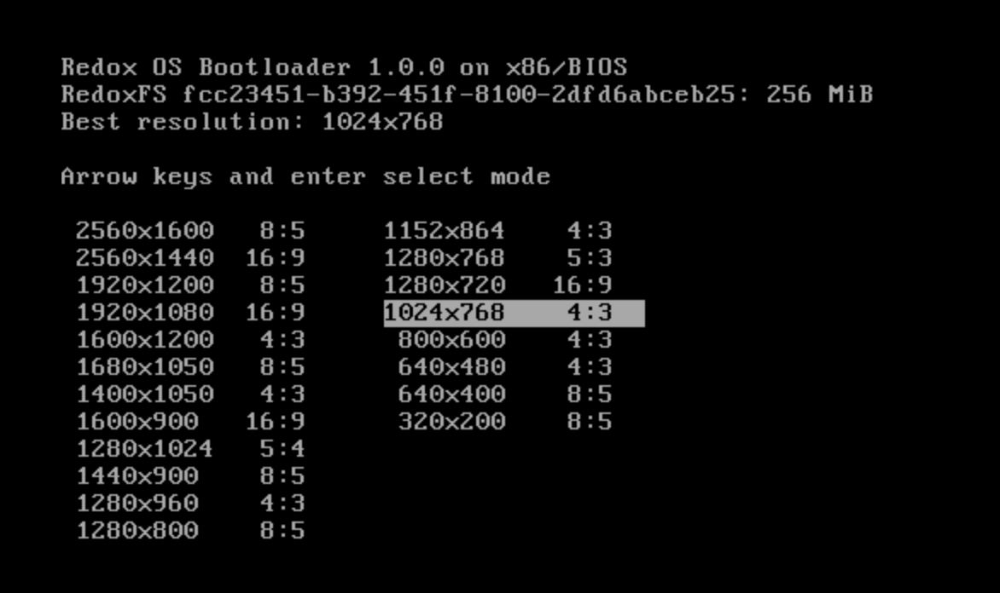
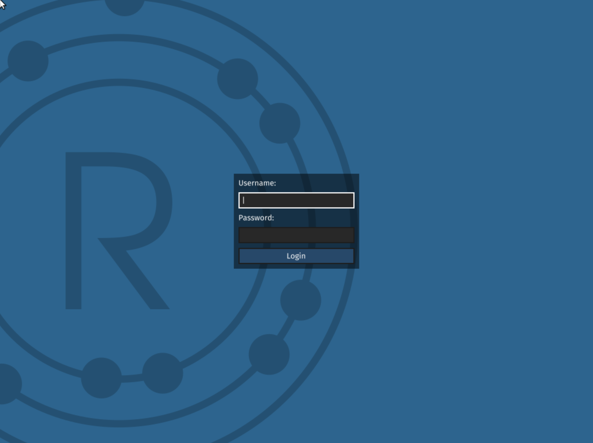
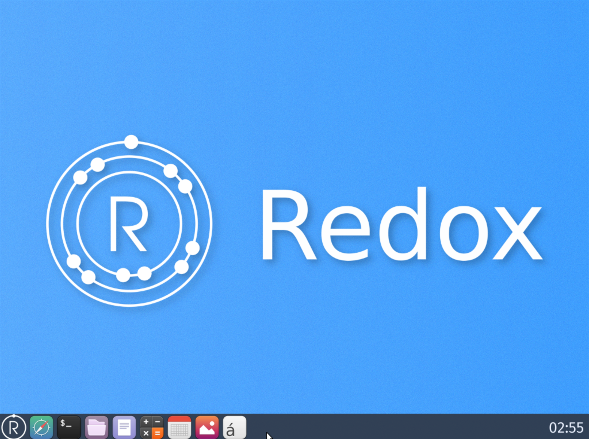

# 可行性报告

——技术路线部分

包括如下内容：

1. 案例：在本地运行 [BlogOS](https://github.com/phil-opp/blog_os) 和 [Redox](https://gitlab.redox-os.org/redox-os/redox/) 两个项目，记录配环境的过程。
2. 提出 x-realism 项目技术路线。

本机环境：


## 案例

### BlogOS

1. 安装 Rust 的 nightly 版本，nightly 类似 Rust 的 beta 或者 prerelease 版，有很多新特性，一般开发 OS 都是选用 nightly，只要是按照 [The book](https://doc.rust-lang.org/book/) 安装的 Rust，用 rustup 就可以安装：

   ```shell
   $ rustup default nightly
   ```

   （这条命令还会切换对应的命令，例如 `rustc` 等使用 nightly 版本），要切换回来只要：

   ```shell
   $ rustup default stable
   ```

   由于 nightly 版本更新快，需要经常 `rustup update`。

2. 到 GitHub 上 clone 该 Repo，clone 下来的默认只有 main 分支，我们可以通过

   ```shell
   $ git worktree add <subdirname> post-xx
   ```

   来创建一个名为 `subdirname` 的子目录，包含 post-xx 分支的内容。

3. 来到对应博客，照着敲命令就行。例如对于 post-01，命令为：

   ```shell
   $ rustup target add thumbv7em-none-eabihf
   $ cargo build --target thumbv7em-none-eabihf
   ```

   post-02：

   ```shell
   $ cargo install bootimage
   $ rustup component add llvm-tools-preview
   $ cargo bootimage
   $ cargo run
   ```

### Redox

Redox 只要按照仓库中 README 的 Quick Setup 部分来：

```shell
# Run bootstrap setup
$ curl -sf https://gitlab.redox-os.org/redox-os/redox/raw/master/bootstrap.sh -o bootstrap.sh && bash -e bootstrap.sh

# Change to project directory
$ cd redox

# Build Redox
$ make all

# Launch using QEMU
$ make qemu
```

其中 `curl` 和 `make all` 这两步可能会消耗大量的时间。由于 Redox 不仅是一个内核，还是成熟的操作系统，最终占了 11.7 GB 的磁盘空间，因此在开始之前应该检查一下磁盘空间是否充足。

执行 `make qemu` 后，会来到选择分辨率的界面：



随便选一个合适的，就可以进入 Redox：



使用搜索引擎，发现默认 Username 为 `user`，Password 为空，进入桌面：



## 技术路线

### Rust 内核

#### Step1 Bare-metal

Bare-metal（裸金属），有时也称（freestanding），指的是可以在不依赖操作系统运行的可执行文件。因为要写一个 Rust 微内核，我们第一步就需要写出能够在 x86 机器上直接运行的 bare-metal 可执行文件，这在很多教程里都有提及，本项目主要参考 BlogOS 和 rCore。在写出一个 bare-metal 可执行文件后，逐步往里面添加所需的功能。在 [ysy 的可行性报告](./2022.4.18%20feasibility-ysy.md) 中给了一个 bare-metal 的案例，这里不多赘述。

#### Step2 进程调度 和 IPC

进程调度和 IPC（InterProcess Communication，进程间通信）是我们第一步要添加的内容。高性能和多任务并发的支持是本项目内核计划实现的两个特性，因此进程调度和 IPC 显得尤为重要。

Rust 语言本身提供对并发的支持。在多进程并行工作时，一个进程所需的数据可能需要另一个进程提供，而该进程可能尚未计算得到该数据，在 Rust 中，`Future` trait 表示一个值是否已经可以使用：

```rust
pub trait Future {
    type Output;
    fn poll(self: Pin<&mut Self>, cx: &mut Context) -> Poll<Self::Output>;
}
```

`poll` 方法将返回 `Poll` enum：

```rust
pub enum Poll<T> {
    Ready(T),
    Pending,
}
```

同时，Rust 中的关键字 `async` 和 `await` 可以让编译器将看似同步的代码编译为异步代码。我们计划利用这些特性实现我们自己的进程调度和 IPC 模块。

#### Step3 内存管理和 MMU

TODO

#### Step4 中断

TODO

### 微内核

微内核主要体现在内核提供的功能。在实现了进程管理，内存管理和中断后，我们的内核就实现了微内核的基本功能。