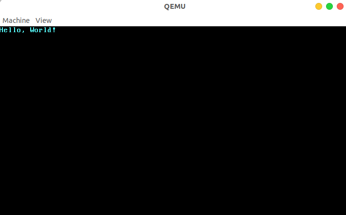

## 理论依据

### Rust 优越性

Rust 的一些有点以及和其它语言的对比可参见[调研报告](../research.pdf)。以下再简要概括与总结用 Rust 完成本项目的原因。

#### 特性

##### 高效

得益于各种零抽象开销、深入到底层的优化潜力、优质的标准库和三方库实现，Rust 具备非常优秀的性能，其运行效率和 C/C++ 是一个级别。

此外，Rust 的高效还体现在开发上，只要你的代码能通过 Rust 编译器，无需深入优化，在一定程度上就已经具备了优秀的性能。

##### 安全

在安全方面，Rust 有着一套相当完备的特性来保证，包括内存管理(RAII 模式)、所有权模型、智能指针、生命周期、借用规则、移动语义、类型安全、并发编程模型、错误处理等等，再加上 Rust 强大的编译器，同样的，能通过编译的代码在安全性上已经得到的较好的保证。

#### 外部函数接口（FFI）

因本项目主要用 Rust 完成，下面侧重 Rust 调用外部函数(以 C 为例)。

要把 C 函数给Rust使用，需要用extern "C"标识出一个块，在块内给出C函数的声明；原始 C API 需要需要封装才能提供内存安全性和利用像向量这样的高级内容，直接调用 C函数显然是不安全的，因为 Rust 编译器不会对其进行检查。因此 Rust 规定，调用 C 函数时必须在 unsafe 块中进行，但为了安全性的目标，需要尽力避免这样的操作。

一个比较好的方式是一个库可以选择只暴露出安全的，高级的接口并隐藏不安全的底层细节，我们需要保证声明的正确性，同时对原生的 C API 进行封装，以保证内存安全。例如，在使用 Vector 与 C 模块对接时，需要把 Vector 转换为内存中的指针，这时我们可以用一个模块封装处理对接的函数，只暴露安全、高级的接口，隐藏非安全的内部细节。

#### why Rust

小结一下，本项目的目标是写一个内核，属于系统编程范畴，具有有如下相关需求

- 对硬件的控制
- 对系统底层的控制
- 对 CPU 和内存的高效利用
- 对运算性能的要求
- 对系统安全和内存安全的要求

综合前面的调研结论，总结如下

- 目前常见的操作系统内核都是基于 C 语言的，而 Rust 则是近几年迅速发展，其它语言写操作系统并无竞争力。

- C 语言是为写 UNIX 而诞生的。但是它并不能帮助高效地开发复杂与并发的操作系统(从面向未来角度考虑)，从当时实际情况来看，仅仅是希望用一种简洁的方式来代替难以使用的汇编语言抽象出计算机的行为。
- C 语言本身几乎不保证安全性（例如指针，虽然灵活但同样是大量 bug 的罪魁祸首），且 C 语言缺少有效的并发支持。这导致内存和并发漏洞成为当前基于 C 语言的主流操作系统的噩梦。
- Rust 语言具有与 C 一样的硬件控制能力，且大大强化了安全编程和抽象编程能力。从某种角度上看，新出现的 Rust 语言的核心目标是解决 C 的短板，取代 C（可以将 Rust 看做 C/C++ + 内存安全）。所以可以预见，用 Rust 写 OS 将具有很好的开发和运行体验。
- 用 Rust 写 OS 的代价是值得的，虽然其学习曲线可能相对陡峭，但是开发和调试的代价将远小于 C 。
- 考虑本项目需要实现的相关特性和要求，Rust 完美适配高性能和安全的要求。

综上所述，最终选择 Rust 作为开发语言。

### 微内核相关

#### IPC 实现

IPC 实现部分基于 seL4 的实现思路。

##### 消息传递

IPC 具体来说通过端点（Endpoint）进行。端点可以被认为是一个邮箱，发送者和接收者通过该邮箱通过握手交换消息。任何拥有 Send 能力的人都可以通过 Endpoint 发送消息，任何拥有 Receive 上限的人都可以接收消息。这意味着每个端点可以有任意数量的发送者和接收者。特别是，无论有多少线程尝试从 Endpoint 接收，特定消息仅传递给一个接收者（队列中的第一个接收者）。

在调用时 send-only 操作不返回成功指示，只发送 IPC 系统调用 `Send`，从而实现单向数据传输。send-ony 不能用于接收任何信息。结果状态，指示消息是否已被传递，将构成反向通道：接收者可以使用结果状态向发送者发送信息。这将导致允许未经能力明确授权的信息流，不符合设计。(可以将这一点看作是特性)

除“端点对象”外，还要有“通知对象”，这一点的设计与绝大多数的操作系统设计类似，在逻辑上是一个二进制信号量的小数组。它具有相同的操作：“信号”(`Signal`)和“等待”(`Wait`)。所谓二进制也就是互斥的，通过通知对象来进行互斥资源的管理。

一个简单的设计如下：发出通知需要知道通知对象(Notification objects)的发送上限，这个上限相当于一个标记，是创建者（通常是通知对象的所有者）设置的位模式。Signal 操作对 Notification 的位数组上的标记进行按位**或**运算。等待操作**阻塞**直到数组**非零**，然后返回位串并将数组**清零**。

##### 快速路径

此前于调研报告中提到 seL4 的快速路径思想可以借鉴，用来实现高效的 IPC。

快速路径(fastpath)是在微内核上的附加前端，用于快速处理一些简单而常用的操作，这样能加速 IPC 的一些步骤执行，从而达到高 IPC 性能。启用或禁用快速路径不会对内核行为产生任何影响，但对性能可以起到优化。

具体实现上，快速路径是内核中经过高度优化的路径，特点就是快。在 seL4 中为了使用快速路径，IPC 必须满足以下条件：

- `seL4_Call`或`seL4_ReplyRecv`必须使用。
- 消息中的数据必须适合`seL4_FastMessageRegisters`寄存器。
- 进程必须具有有效的地址空间。
- 不得转移任何上限。
- 调度程序中的其他线程不能运行，其优先级高于 IPC 未阻塞的线程。

> `seL4_Call` is a system call, in the receive phase, thread which uses this function is blocked on a one-time capability termed a *reply capability*, and not the endpoint itself.
>
> The reply capability is stored internally in the thread control block (TCB) of the receiver. The system call `seL4_Reply` invokes this capability, which sends an IPC to the client and wakes it up. `seL4_ReplyRecv` does the same, except it sends the reply and blocks on the provided endpoint in a combined system call.

在快速路径中，消息通过寄存器传递(也即上文的`seL4_FastMessageRegisters`)，无需其它复杂的操作，因而起到高效的目的。

seL4 项目是用 C 语言实现的，我们后续需要完成的是针对其中的快速路径及相关模块用 Rust 进行改写，如上述 seL4 相关的系统调用需适配我们自己的 API，这方面也可以参考 libsel4 的 System Calls 部分，最终的目的还是实现高效的 IPC。

## 技术依据

### 环境及语言支持

主要环境为如下两项

- Rust/C 开发环境配置
- Qemu 模拟器

C 开发环境是因为本项目设计改写一些 C 模块。

#### no std

本项目要编写一个操作系统内核，我们需要编写不依赖任何操作系统特性的代码。这意味着我们不能使用线程、文件、堆内存、网络、随机数、标准输出，或其它任何需要操作系统抽象和特定硬件的特性；因为我们正在编写自己的操作系统和硬件驱动。

实现这一点，意味着我们不能使用 Rust 标准库(std)的大部分；好在 Rust 有一个对 Rust 语言标准库–std 裁剪过后的 Rust 语言核心库 core。core库是不需要任何操作系统支持的，虽然它的功能也比较受限，但是也包含了 Rust 语言相当一部分的核心机制/特性，是我们依然可以使用的，例如，迭代器、闭包、模式匹配、Option、Result、字符串格式化以及所有权系统。这些剩下的功能也还让我们能够编写表达性强、高层抽象的操作系统，而无需关心未定义行为和内存安全，可以满足我们的大部分功能需求。同时作为一门面向系统（包括操作系统）开发的语言，有很多第三方库也不依赖标准库 std 而仅仅依赖核心库 core。我们同样可以使用这些库，对它们的使用可以很大程度上减轻我们的编程负担。

### 裸机程序 demo

为了表明用 Rust 编写操作系统的可行性，我们首先确保能够用 Rust 构建一个内核最小执行环境，并编写一个独立于操作系统的可执行程序。

Rust 相关环境配置

```bash
rustup install nightly
rustup default nightly
cargo install cargo-binutils
rustup component add llvm-tools-preview
rustup component add rust-src
cargo install cargo-xbuild
cargo install bootimage
```

以上包括安装 Nightly Rust（提供实验性的功能）、`cargo xbuild`工具（以进行交叉编译）、`bootimage` 工具（创建可引导的磁盘映象）、`rustup` 模块 `llvm-tools-preview`（以编译引导程序）。

目标三元组配置清单（`x86_64-os.json`）

```json
{
    "llvm-target": "x86_64-unknown-none",
    "data-layout": "e-m:e-i64:64-f80:128-n8:16:32:64-S128",
    "arch": "x86_64",
    "target-endian": "little",
    "target-pointer-width": "64",
    "target-c-int-width": "32",
    "os": "none",
    "executables": true,
    "linker-flavor": "ld.lld",
    "linker": "rust-lld",
    "panic-strategy": "abort",
    "disable-redzone": true,
    "features": "-mmx,-sse,+soft-float"
}
```

以上为描述目标系统的配置清单，三元组为基于`x86_64`架构，无明确平台供应者，暂无操作系统（`None`）

`Cargo.toml` 配置

```rust
[package.metadata.bootimage]
build-command = ["xbuild"]

[dependencies]
bootloader = "0.9.3"
```

使用已有的`bootloader`包来实现 BIOS 引导程序（基于 Rust 和内联汇编），这也省去了我们自己写汇编的步骤，否则，若是我们基于 risc-v 架构，目前还没这样的工具，就需要自行写汇编，徒增负担。由此可见，基于`x86`架构的一大好处是已经有了成熟的工具链帮助开发，使得风险可控。

 `.cargo/config` 配置

```rust
[build]
target = "x86_64-os.json"

[target.'cfg(target_os = "none")']
runner = "bootimage runner"
```

编译目标以及`qemu`运行相关配置，后续使用`cargo xrun`即可编译并在`qemu`中启动运行。

`main.rs` 内容

```rust
#![no_std]
#![no_main]

use core::panic::PanicInfo;

#[panic_handler]
fn panic(_info: &PanicInfo) -> ! {
    loop {}
}

static HELLO: &[u8] = b"Hello, World!";

#[no_mangle]
pub extern "C" fn _start() -> ! {
    let vga_buffer = 0xb8000 as *mut u8;

    for (i, &byte) in HELLO.iter().enumerate() {
        unsafe {
            *vga_buffer.offset(i as isize * 2) = byte;
            *vga_buffer.offset(i as isize * 2 + 1) = 0xb;
        }
    }

    loop {}
}
```

以上仅仅为实验样例而使用了 unsafe 块，后续出于安全性考虑将尽力避免或者进行封装。

这样就完成了一个最小化内核，能够通过写入 VGA 字符缓冲区的方式，向屏幕输出字符串。



## 技术路线

### Step1 Bare Metal

首先，要完成操作系统的一项基本功能，实现应用与硬件隔离。

基本目标是创建一个不链接**标准库**的 Rust 可执行文件，并在此基础上构建一个最小化内核，使得能够无需底层操作系统的支撑，在**裸机**（bare metal）上运行 Rust 代码，为后续设计打下基础。

进阶目标是封装成函数库的形态，为内核支持函数库的形态，基于 `RustSBI`完成输出及关机。

这一步重点是让内核首先能跑起来。

### Step2 地址空间

其次，需要实现内核的安全核心机制：**内存隔离**，建立起**地址空间**的抽象。

基本目标是实现动态内存分配，分页式内存管理，建立虚拟内存和物理内存的页映射关系，实现轻量级隔离。当然，这也需要硬件的支持，需要考虑硬件细节，关于页表的设计需要好好构思。重点关注安全性。

进阶目标是基于地址空间实现多任务的支持。有空的话还可以做其它硬件相关的支持，如中断支持等。

### Step3 进程

接着，实现进程以及基于进程相关的系统调用。

基本目标包括常规的进程管理，创建进程、销毁进程、进程等待；进程调度相关的算法实现；进程间通信，上下文切换的高效实现。重点关注高效性。

部分模块需要利用或改写其他项目已有的设计（seL4、Redox）

进阶目标是开发出 shell，实现更好的交互。

### Step4 并发

然后，实现对并发的支持。

基本目标不仅仅是进程间的并发，还有进程内的并发，也就是线程相关。设计用户态和内核态的线程管理，实现同步，提供信号量、条件变量、互斥锁机制等。

### Step5 其他模块

最后，就是实现一些可选的模块，例如文件系统，I/O 等等，这将视前面的完成情况而定。

### 小结

整体思路上，遵循由简到繁的开发过程。根据特性（需求）逐步添加或增强操作系统功能，添加完善模块，实现良好的组织（微内核架构），最终完成我们的内核设计。

## 参考资料

[Rust FFI examples](https://github.com/alexcrichton/rust-ffi-examples)

[Blog OS 最小内核实现](https://os.phil-opp.com/minimal-rust-kernel/)

[seL4 手册](https://sel4.systems/Info/Docs/seL4-manual-latest.pdf)

