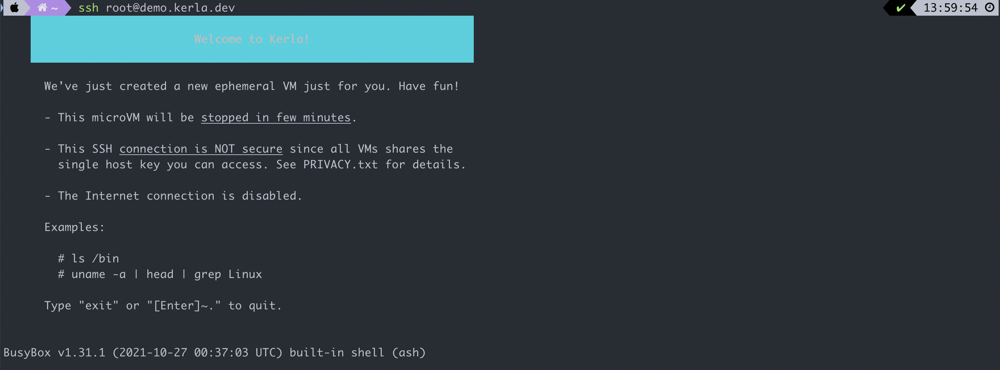

# 调研报告

    —— 关于 Rust 开发 OS 的主流做法和代表性项目

本次报告基于 2022.4.3 的调研报告，完善了相关项目的介绍，同时简述了当前操作系统开发的问题以及使用 Rust 开发 OS 的主流做法（需要解决的问题）。

## 当前操作系统开发面临的问题

目前流行的三大操作系统 Windows，Mac OS（现也称 OS X 或 Darwin），Linux 都面临着不足，下面简述它们的主要缺点：

### Windows

+ 系统稳定性差。Windows 的各个程序不是相互独立的，软件的崩溃容易导致系统瘫痪。
+ 软件管理安装机制差，软件和软件之间不隔离配置，而是共用一个庞大的全局注册表，各个软件有自己设计的安装和卸载机制，从而很难说删除“干净”某个软件
+ 安全性差，即使存在自带的 Windows Defender，电脑仍然容易遭受病毒的攻击，因此常常需要不断地进行系统更新以获取最新的安全补丁。

### Mac OS

+ 软件兼容性和生态差。
+ 硬件升级和定制化困难，因为 Mac 电脑的 CPU 和内存等与其他硬件和操作系统的耦合性很高，更换硬件可能导致系统拒绝启动。

### Linux

+ 驱动问题。Linux 无法做到系统与驱动分离，驱动没有稳定的接口，内核变动时驱动就得跟着变动，导致驱动的开发困难，很多设备缺乏好用的驱动。
+ 发行版过多，缺乏统一的社区，不同 Linux 发行版的软件生态不同。
+ Linux 内核是宏内核，可移植性较差（具体可以参看 [ysy 的调研报告](https://github.com/OSH-2022/x-realism/blob/main/reports/research/2022.4.5%20research-ysy.md)）。

## Rust 开发操作系统的主流做法

### 用什么语言写操作系统？

最初的 Unix 系统是完全用汇编语言写出来的，之后 B 语言和 NB (New B) 语言都被使用过。由于这些语言中只能处理计算机字节，没有类型并且不支持浮点运算，Dennis Ritchie 发明了 C 语言，C 语言从那以后就成为了开发操作系统最流行的编程语言。如今主流操作系统内核的少数部分也用 C++ 实现。

但是编写操作系统内核并不是只能用汇编跟 C，C++，一门语言能否用于编写操作系统，取决于其二进制代码是否能够在裸机上执行（也即不依赖标准库），因为标准库要依赖操作系统为其提供系统调用。早期的 Mac OS 曾经使用 Pascal 编写。

>In principle, any language with the ability to interact with lower-level code can be used to write operating systems.

Rust 因其高效，无 GC，面向对象，同时拥有高安全性的优势成为开发内核的有力竞争者。本文并不论述 Rust 的优势，仅阐述面对 Rust 开发 OS 的问题时，主流做法都有哪些。

### 问题和主流做法

#### no_std

使用 Rust 开发就不能使用标准库 `std`, 此时需要在模块顶部引入 `#![no_std]` 来使用核心库。核心库中定义的是 Rust 语言的核心，不依赖于操作系统和网络等相关的库，甚至不知道堆分配，也不提供并发和 I/O。

核心库和标准库的功能有一些重复，包括如下部分：

- 基础的 `trait`，如 `Copy`、`Debug`、`Display`、`Option` 等。
- 基本原始类型，如 `bool`、`char`、`i8/u8`、`i16/u16`、`i32/u32`、`i64/u64`、`isize/usize`、`f32/f64`、`str`、`array`、`slice`、`tuple`、`pointer` 等。
- 常用功能型数据类型，满足常见的功能性需求，如 `String`、`Vec`、`HashMap`、`Rc`、`Arc`、`Box` 等。
- 常用的宏定义，如 `println!`、`assert!`、`panic!`、`vec!` 等。 做嵌入式应用开发的时候，核心库是必需的。

#### 跟 C 语言之间的互相调用（ABI）

在操作系统底层，可能需要 C 和 Rust 语言之间的互相调用，接口目前已经实现好了，可以实现在编译 C 程序时把 Rust 静态链接库链接到其中，也可以在编译 Rust 时链接 C 语言代码，示例参见下面的 GitHub 仓库：[RustSamples](https://github.com/wangrunji0408/RustSamples/tree/master/rust_call_c). 但有时 Rust 与 C 的交互也并不那么直接，这主要是因为很多 C 库有它们自己对对象生命周期的管理方式。

#### 内存模型

由于 Rust 特有的变量生命周期及借用等机制，所有变量在内存中都是可移动的，这对于引用 Linux 的数据结构来说是会有问题的。例如在 safe Rust 中，诸如双向链表这样的数据结构无法被实现，为了解决该问题就需要引入 unsafe 的 Rust 代码，这样的话 Rust 的安全优势也将荡然无存。而且内存模型的问题还远不止数据的申请、释放与内存布局，在多核时代内存模型还增加了操作系统在保证执行顺序与并发灵活性之间复杂的取舍策略。该取舍策略非常复杂，本文不做过多探讨。

#### panic、alloc到底如何实现

在 Linux 当中一旦内核态的代码执行中出现不可恢复的错误，一般是通过 panic 操作来记录相关信息及调用栈，但由于 Rust 的内存申请与释放机制，其编译器通常会隐藏内存分配的操作，这就很可能使 `panic!` 的调用出现问题。而且在某些驱动程序中，内存分配失败不应该直接使内核产生 panic，因此 Rust 在申请内存失败后如果直接调用 `panic!`，可能也是错误的。

而且在 Linux 标准接口中的内存分配 alloc API 也需要为 Rust For Linux 项目做好准备。标准库的所有堆分配对象类型（例如 Box 和 Vec）都使用假定不会失败的分配机制。在用户空间中，这种假设并非完全不切实际，因为页面交换、写入时复制和按需分页会产生可用内存充足的错觉。可用物理内存实际用完的故障点可能只有在用于分配它的系统调用很久之后才能发现。然而，在内核空间中，几乎没有内存可以安全地换出到持久存储，并且链中没有更靠后的系统可以处理分配失败的问题。因此，在内核中使用标准容器类型是危险的。建议的解决方案是明确分配失败的可能性。更改各种容器类型以应对故障，这需要对 Rust 代码的编写方式进行重大更改，但简单地扩展当前实现以提供额外的构造函数可能是可行的，如果分配失败，它将返回错误。从目前来看，实现 alloc 这些标准接口，很可能会大量引入很多 unsafe 的 Rust 代码，这将使 Rust 的价值大大降低。

#### 稳定内联汇编-Rust操作系统的必由之路

其实即使是 C 语言也无法单独完成开发一整套操作系统的任务，汇编语言在很多情况下是操作系统所必须的，因为有一些关键操作必须直接调用 CPU 底层的指令才能执行，目前 Rust 在开启 `#!(feature(asm))` 的情况下可以支持内联汇编，但是目前 Rust 对于内联汇编语言的支持并不成熟，更不算稳定，还需要进一步完善。

#### 架构支持（Architecture support）

目前，唯一成熟 Rust 编译器只有 rustc 这一个，它是通过 LLVM 来生成指令码。Linux 内核支持许多种体系架构，其中一些架构并没有现成的 LLVM 后端（backend）。其他一些架构存在 LLVM 后端，但 rustc 还尚未不支持该后端。目前的解决方案是”先让一部分架构 Rust 起来”。

## Rust 开发 OS 的代表性项目

对于每个项目，我主要介绍其与本项目相关性，及重要的特性（与本项目相关将加粗），并评价其可参考性（很高，高，较高，一般和差）

### Redox

[Homepage](https://www.redox-os.org/),[GitLab Repo](https://gitlab.redox-os.org/redox-os)

> **Redox** is a Unix-like Operating System written in [**Rust**](https://www.rust-lang.org/), aiming to bring the innovations of Rust to a modern microkernel and full set of applications.

文档非常详细，有一本书 [Redox book](https://doc.redox-os.org/book/) 详细介绍了设计的思路，可以作为参考。

其主要特性如下：

+ 类 Unix 操作系统，包括常见的 Unix 命令

+ **微内核设计**
+ 包括可选的 GUI 程序 - Orbital
+ 支持 Rust 标准库
+ 用 Rust 编写的 *libc*
+ 驱动运行在用户空间

微内核设计的 Rust 内核较少，该项目当前仍在积极维护并且有详细的文档，可参考性**很高**。

### Theseus

[Homepage](https://www.theseus-os.com/), [GitHub Repo](https://github.com/theseus-os/Theseus)

同样有详细的文档，主要特性如下：

+ 内核架构：既不是宏内核也不是微内核，被称作 Safe-language SAS/SPL OS

  官方对该架构的解释是

  > Theseus is a safe-language OS that runs all components within a [Single Address Space (SAS)](https://en.wikipedia.org/wiki/Single_address_space_operating_system) and Single Privilege Level (SPL).

  与其他内核对比的优势可以参考 [Theseus Book](https://www.theseus-os.com/Theseus/book/design/design.html)，简单概括一下就是该操作系统的结构设计不在任何方面依赖于底层硬件的结构。所有内容（包括应用程序，系统服务和核心内核组件）都存在并在单个地址空间和单个权限级别中运行（在“内核空间”中）。Theseus 的结构纯粹是软件定义的，并基于 *cell*（该项目模块的叫法）的模块化概念。因此，通信和共享内存访问是**高效**的，因为编译器确保了隔离和保护。

+ **高性能**

+ **虚拟内存映射到物理内存**

+ 支持 **multitask**，多个任务可以并发执行，并共享 CPU 和内存资源。

在其文档中专门介绍了内存管理和任务管理两个模块，可参考性**高**。

### BlogOS

[Homepage](https://os.phil-opp.com/), [GitHub Repo](https://github.com/phil-opp/blog_os)

一个博客系列，每篇博客有教程和完整的代码，对应 GitHub Repo 里的一个个 branch。主要特性如下：

+ **中断**（同时介绍了硬件中断）
+ 段页式内存管理
+ **multitask**

每个 branch 有直接能跑的轮子，可参考性**高**

### rCore

[GitHub Repo](https://github.com/rcore-os/rCore)

THU 的操作系统项目，基于上面说的 BlogOS，相对更贴近大作业项目的水平。特点：

+ 支持多种架构（包括 **x86**，但是没有 ARM）
+ 模块化内存管理和进程管理
+ 支持多核调度

中文项目，[文档](https://rcore.gitbook.io/rust-os-docs/)详细，可参考性**高**。

### Kerla

[Homepage](https://kerla.dev/), [GitHub Repo](https://github.com/nuta/kerla)

仓库介绍:

> Kerla is a monolithic operating system kernel written from scratch in Rust which aims to be compatible with the Linux ABI, that is, it runs Linux binaries without any modifications.

目标是在 ABI 层面上兼容 Linux，主要特性如下：

+ 进程管理，包括上下文切换，`fork`, `execve`, `wait` 等
+ 常见的系统调用
+ 伪文件系统
+ tty 和伪终端
+ **x86 架构**

一个有意思的点在于我们可以直接通过 ssh 进入 Kerla，无需部署就可以看看别人做出来的内核是什么样的：、

文档不够详细，可参考性**较高**。

### Tock

[Homepage](https://www.tockos.org/), [GitHub Repo](https://github.com/tock/tock)

是一个**嵌入式操作系统**，主要特性如下：

+ 低功耗
+ 占用资源少
+ 扩展性强
+ **并发**
+ **隔离性好**

由于主要面对嵌入式领域，特性明显是针对嵌入式设备的特点，但依然可以参考其并发和隔离的部分，可参考性**较高**（文档同样不够详细）。

### Rust for Linux

[GitHub Repo](https://github.com/Rust-for-Linux?utm_source=thenewstack&utm_medium=website&utm_campaign=platform)

一个 GitHub 组织，得到了 Google 的大力支持，致力于提供 Rust 对 Linux 内核的各种支持.

> 2021年7月4日，Linux内核团队发布添加Rust支持的“v1”补丁；
>
> 2021年12月6日，Linux内核团队发布支持Rust 的“v2”补丁。

在 2021 年底，Rust 已经成为 Linux 开发的官方语言。据报道，到 2022 年，开发者有望看到 Linux 内核正式支持 Rust。截止 2022 年 4 月 3 日该仓库已经发布了 "v5" 补丁。

由于我们的目标并不一定要实现一个类 Unix 操作系统，更不可能实现一个完整功能的 Linux 系统，可参考性**一般**。

### Red Leaf

[GitHub Repo](https://github.com/mars-research/redleaf)

> RedLeaf is a research operating system developed from scratch in Rust to explore the impact of language safety on operating system organization.

文档不详，近期（3个月内）没有维护，可参考性**一般**。

### intermezzOS

[Homepage](http://intermezzos.github.io/), [GitHub Repo](http://intermezzos.github.io/)

> intermezzOS is a teaching operating system, specifically focused on introducing systems programming concepts to experienced developers from other areas of programming.

一个教学用的操作系统，旨在向其他领域的程序员介绍系统方向的编程。三年前就停止了维护，同时文档对项目的特性介绍不详，可参考性**差**。

### Reenex

[GitHub Repo](https://github.com/scialex/reenix)，基于布朗大学 [CS167/9](https://brown-cs1690.github.io/brown-cs167-s22/#/) 课程的 Weenix 操作系统，实现了基础的 kernel shell，多进程调度和磁盘写入功能，七年前就已经停止维护，可参考性**差**。

## 参考资料

[操作系统对比和未来展望](https://blog.csdn.net/z2431435/article/details/108928373)

[Windows 有哪些令人无法忍受的缺点？](https://www.zhihu.com/question/20587638)

[Advantages and disadvantages of Windows operating system](https://www.geeksforgeeks.org/advantages-and-disadvantages-of-windows-operating-system/)

[macOS Review: The Pros and Cons](https://www.konsyse.com/articles/macos-review-the-pros-and-cons/)

[Linux系统有哪些缺点？](https://www.zhihu.com/question/309704636#:~:text=%E4%B8%8EWindows%E7%B3%BB%E7%BB%9F%E4%B8%8D%E5%90%8C%EF%BC%8CLinux,%E4%BB%BB%E5%8A%A1%E7%B3%BB%E7%BB%9F%E8%A6%81%E7%A8%B3%E5%AE%9A%E8%AE%B8%E5%A4%9A%E3%80%82&text=Linux%E7%9A%84%E7%BC%BA%E7%82%B9%E4%B9%9F%E6%98%BE%E8%80%8C%E6%98%93%E8%A7%81,%E4%B8%80%E4%B8%AA%E6%9E%81%E5%A4%A7%E7%9A%84%E5%8E%9F%E5%9B%A0%E3%80%82)

[Ownership is Theft: Experiences Building an Embedded OS in Rust](https://patpannuto.com/pubs/levy15ownership.pdf)

[Linux Plumbers: 想在内核里引入Rust，还需要做很多决定](https://zhuanlan.zhihu.com/p/202143324)

[世界上最著名的操作系统是用什么语言编写的？](https://www.163.com/dy/article/GLS55LDI055242UD.html#:~:text=%E7%8E%B0%E5%9C%A8%EF%BC%8CC%20%E8%AF%AD%E8%A8%80%E5%B7%B2%E7%BB%8F%E6%88%90%E4%B8%BA,%E6%9D%A5%E8%AF%B4%E6%98%AF%E4%B8%80%E4%B8%AA%E6%A2%A6%E3%80%82)

[写操作系统只能用汇编和 C 语言吗？](https://www.zhihu.com/question/26834043)

[Rust no-std 工程实践](https://juejin.cn/post/6999830218051420190)

[用 Rust 开发 Linux，可行吗？](https://www.163.com/dy/article/GO2S72K60511FQO9.html)

[OS Development in Rust](https://www.research-collection.ethz.ch/bitstream/handle/20.500.11850/155725/eth-49224-01.pdf)

[Rust OS comparison](https://github.com/flosse/rust-os-comparison)

[新增3.2万行代码，Linux内核有望在2022年正式支持Rust ](https://www.sohu.com/a/506663159_115128)

[如何用 Rust 编写一个 Linux 内核模块](https://developer.51cto.com/article/670600.html) (本文中简述了如何编译一个包含 Rust 支持的 Linux 内核)

[开源项目：使用 Rust 写一个兼容 Linux 的内核](https://jishuin.proginn.com/p/763bfbd6be97)

[Rust is now an official language for Linux development](https://twitter.com/ossia/status/1468663047447355400?ref_src=twsrc%5Etfw%7Ctwcamp%5Etweetembed%7Ctwterm%5E1468663047447355400%7Ctwgr%5E%7Ctwcon%5Es1_&ref_url=https%3A%2F%2Fthenewstack.io%2Frust-in-the-linux-kernel-good-enough%2F)

[A comparison of operating systems written in Rust](https://rustrepo.com/repo/flosse-rust-os-comparison-rust-operating-systems)