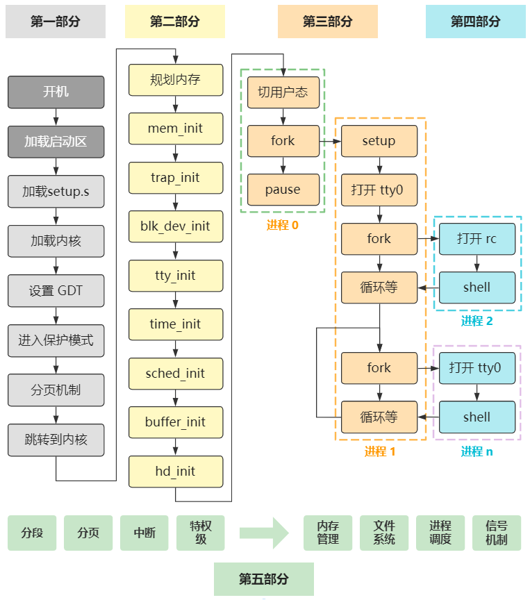

# 完成一个操作系统需要哪些工作

## 操作系统做了什么事

管理计算机的资源；为用户/应用使用提供一层抽象。

### 从管理计算机的资源看

- 进程调度（资源分配）
- I/O操作
- 文件系统操作
- 通信
- 错误检测
- 保护机制

### 从提供用户使用环境看

- 命令行界面、命令解释程序
- 提供给用户调用系统调用的接口

## 写操作系统的规划

0. 搞清楚我们操作系统的服务对象
1. 规划系统特性（结合Rust语言特性，以及目前科研方向/市场方向需求）
2. 在各类模块和子系统的实现中，用什么样的算法、模型（小组研究，也可以结合目前科研界提出的一些新的方向）

总而言之，一切的一切：做好规划，落到实处，不要将操作系统当成空中楼阁。

## 引用

《操作系统概念》亚伯拉罕·西尔伯沙茨

[rCore-tutorial-book](https://rcore-os.github.io/)

[计算机自制操作系统：完成总结](https://zhuanlan.zhihu.com/p/149465851)

